# DOM Manipulation


## Browser JS


### Підключення JS до HTML
JS можна писати всередині тега script:
```html
<script>
alert(1);
</script>
```


### Підключення JS до HTML
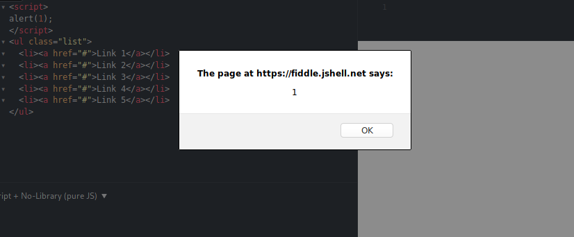


### Підключення JS до HTML
```html
<ul class="list">
  <li><a href="#">Link 1</a></li>
  <li><a href="#">Link 2</a></li>
  <li><a href="#">Link 3</a></li>
  <script>
alert(1);
</script>
  <li><a href="#">Link 4</a></li>
  <li><a href="#">Link 5</a></li>
</ul>
```


### Підключення JS до HTML
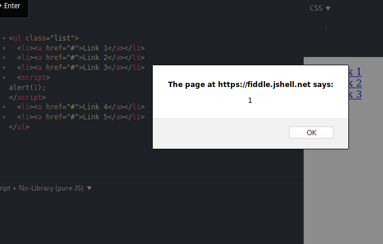


### Підключення JS до HTML
Підключення зовнішнього JS:
```html
&lt;body&gt;
.....
<script type = "text/javascript" src = "filename.js" ></script>
<script type = "text/javascript" src = "filename.js" ></script>
```


## DOM


### DOM

Об'єктна модель документа (англ. Document Object Model, DOM) — специфікація прикладного програмного інтерфейсу для роботи зі структурованими документами (як правило, документів XML). Визначається ця специфікація консорціумом W3C.

З точки зору об'єктно-орієнтованого програмування, DOM визначає класи, методи та атрибути цих методів для аналізу структури документів та роботи із представленям документів у вигляді дерева. Все це призначено для того, аби надати можливість комп'ютерній програмі доступу та динамічної модифікації структури, змісту та оформлення документа.


### DOM
Стандарти W3C DOM і WHATWG DOM формують основи DOM, реалізовані в більшості сучасних браузерів. Багато браузери пропонують розширення за межами даного стандарту, тому необхідно перевіряти працездатність тих чи інших можливостей DOM для кожного конкретного браузера.


### DOM
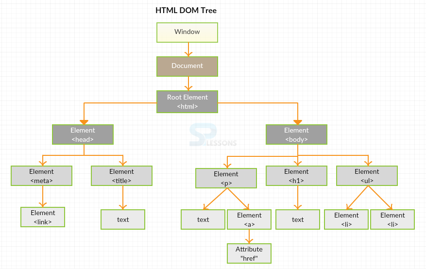


### DOM
```js
console.log(window);
```
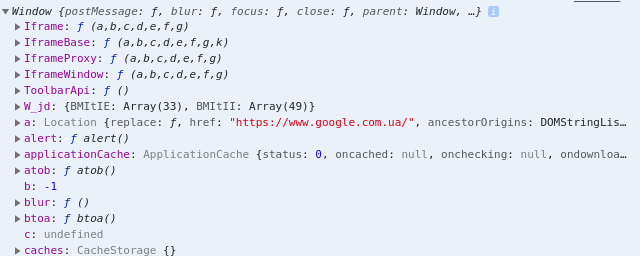


### DOM
```js
console.log(this);
```
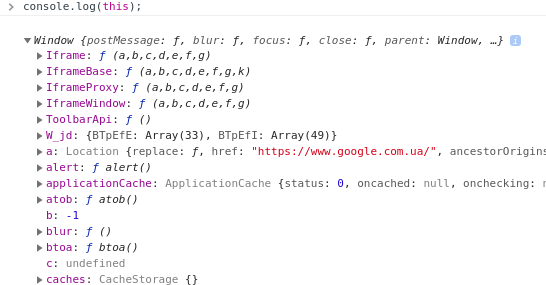


### DOM
```js
console.log(document);
```
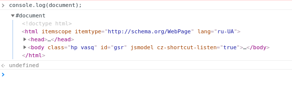


### DOM
```js
console.dir(document);
```
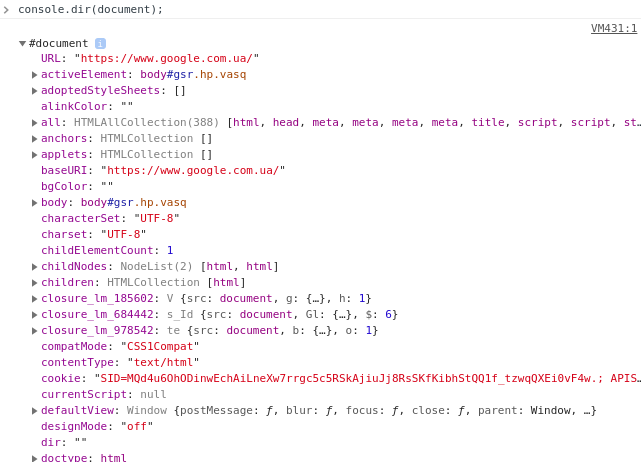


## Пошук Елементів


### Пошук Елементів

- Пошук HTML - елемента по id
- Пошук HTML - елемента по тегу
- Пошук HTML - елемента по класу
- Пошук HTML - елемента з використанням CSS - селекторів
- Пошук HTML - елементів за допомогою колекції HTML об'єктів


### Пошук HTML - елемента по id

```js
var myElement = document.getElementById("intro");
```
Якщо елемент знайдено буде повернено об'єкт. В іншому випадку - null


### Пошук HTML - елемента по id
```html
<h1 id="someTitle"></h1>
```
```js
var someTitle = document.getElementById('someTitle');
console.log(someTitle);
```


### Пошук HTML - елемента по тегу
```js
var x = document.getElementsByTagName("p");
```

Element.getElementsByTagName () метод повертає колекцію елементів HTMLCollection, враховуючи ім'я тега. Пошук здійснюється в під-дереві зазначеного елемента, в результат пошуку не включається сам елемент, в під-дереві, якого здійснювався пошук.


### Пошук HTML - елемента по тегу
```html
<p id="someP">
  text1
  <p id="childP">
     text2
  </p>
</p>

<p id="outherP">
  text3
</p>
```
```js
var allP = document.getElementsByTagName('p');
console.log(allP);
```
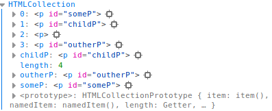


### Пошук HTML - елемента по класу
```js
var x = document.getElementsByClassName("intro red");
```

Повертає массивоподобний (ітераційний) об'єкт всіх дочірніх елементів, які відповідають усім із зазначених імен класів.


### Пошук HTML - елемента по класу
```html
<p class="text intro">
  <p class="text">
      <p class="my-text">
        
      </p>
  </p>
</p>
```
```js
var someP = document.getElementsByClassName("text");
console.log(someP);
```
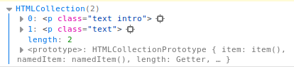


### Пошук HTML - елемента по класу
```html
<p class="text intro">
  <p class="text">
      <p class="my-text">
        
      </p>
  </p>
</p>
```
```js
var someP = document.getElementsByClassName("text");
console.log(someP[0]);
```
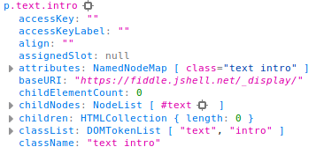


### Пошук HTML - елемента з використанням CSS - селекторів
```js
var b = document.querySelector("#inner");

var x = document.querySelectorAll("p.intro");
var y = document.querySelectorAll("h2, div, span");
```


### Пошук HTML - елемента з використанням CSS - селекторів
```html
<p id="intro">
  
</p>
```
```js
var someP = document.querySelector("#intro")
console.log(someP);
```
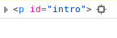


### Пошук HTML - елемента з використанням CSS - селекторів
```html
<p id="intro">
  
</p>
```
```js
var someP = document.querySelectorAll("#intro")
console.log(someP);
```
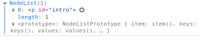


### Пошук HTML - елементів за допомогою колекції HTML об'єктів
Перелік доступних об'єктів:
- document.anchors
- document.forms
- document.images

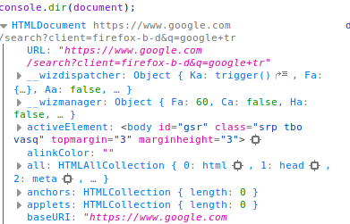


### Пошук HTML - елементів за допомогою колекції HTML об'єктів
```js
var x = document.anchors[0].innerHTML; 
```


## DOM traversing


### children
children - це властивість, яка дозволяє вибирати прямих нащадків (елементи, які вкладені в інший елемент). Вона повертає колекцію HTML, яка оновлюється після зміни елементів дітей.


### children
```html
<ul class="list">
  <li><a href="#">Link 1</a></li>
  <li><a href="#">Link 2</a></li>
  <li><a href="#">Link 3</a></li>
  <li><a href="#">Link 4</a></li>
  <li><a href="#">Link 5</a></li>
</ul>
```
```js
const list = document.querySelector('.list')
const listItems = list.children
console.log(listItems)
```
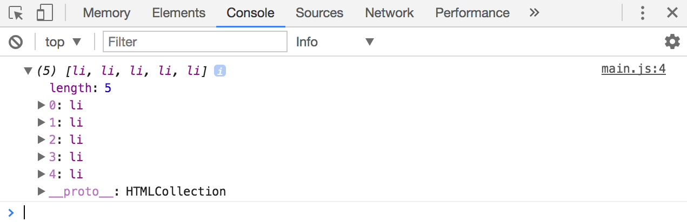


### parent
Існує два способи переходу вгору:
- parentElement
- closest


### parentElement
parentELement - це властивість, що дозволяє вибрати батьківський елемент. Батьківський елемент - це елемент, який охоплює поточний елемент.


### parentElement
```html
<ul class="list">
  <li><a href="#">Link 1</a></li>
  <li><a href="#">Link 2</a></li>
  <li><a href="#">Link 3</a></li>
  <li><a href="#">Link 4</a></li>
  <li><a href="#">Link 5</a></li>
</ul>
```
```js
const firstListItem = document.querySelector('li')
const list = firstListItem.parentElement

console.log(list)
// <ul class="list">...</ul>
```


### closest
closest дозволяє вибрати найближчий елемент предка, який відповідає селектору. Синтаксис:
```js
const closestAncestor = Element.closest(selector)
```


### closest
```html
<ul class="list">
  <li><a href="#">Link 1</a></li>
  <li><a href="#">Link 2</a></li>
  <li><a href="#">Link 3</a></li>
  <li><a href="#">Link 4</a></li>
  <li><a href="#">Link 5</a></li>
</ul>
```
```js
const firstLink = document.querySelector('a')
const list = firstLink.closest('.list')

console.log(list)
// <ul class="list"> ... </ul>
```


### Traversing sideways
Існують три способи, щоб перейти в бік:
- nextElementSibling
- previousElementSibling
- Комбінація parentElement, children, index


### Traversing sideways
```html
<ul class="list">
  <li><a href="#">Link 1</a></li>
  <li><a href="#">Link 2</a></li>
  <li><a href="#">Link 3</a></li>
  <li><a href="#">Link 4</a></li>
  <li><a href="#">Link 5</a></li>
</ul>
```
```js
const firstListItem = document.querySelector('li')
const secondListItem = firstListItem.nextElementSibling

console.log(secondListItem)
// <li><a href="#">Link 2</a></li>
```


### Traversing sideways
```html
<ul class="list">
  <li><a href="#">Link 1</a></li>
  <li><a href="#">Link 2</a></li>
  <li><a href="#">Link 3</a></li>
  <li><a href="#">Link 4</a></li>
  <li><a href="#">Link 5</a></li>
</ul>
```
```js
const secondListItem = document.querySelectorAll('li')[1]
const firstListItem = secondListItem.previousElementSibling

console.log(firstListItem)
// <li><a href="#">Link 1</a></li>
```


### Traversing sideways
```html
<ul class="list">
  <li><a href="#">Link 1</a></li>
  <li><a href="#">Link 2</a></li>
  <li><a href="#">Link 3</a></li>
  <li><a href="#">Link 4</a></li>
  <li><a href="#">Link 5</a></li>
</ul>
```
```js
const firstItem = document.querySelector('li')
const fourthItem = firstITem.parentElement.children[3]

console.log(fourthItem)
// <li><a href="#">Link 4</a></li>
```


## Зміна елементів


### window.onload
Подія onload на window спрацьовує, коли завантажується вся сторінка, включаючи ресурси на ній - стилі, картинки, іфрейми і т.п.

```js
<script>
  window.onload = function() {
    alert( 'Документ и все ресурсы загружены' );
  };
</script>
<iframe src="https://example.com/" style="height:60px"></iframe>

```


### Модифікація внутрішнього вмісту
```html
<a href="" class="link">Home</a>
<a href="" class="link">Reviews</a>
```
```js
var aList = document.querySelectorAll('.link');
for(var i = 0; i < aList.length; i++){
	aList[i].innerText = "Modified";
}
```


### Модифікація внутрішнього вмісту
e = ``<b>Lorem Ipsum</b> ``

```js
e.innerHTML = "<i>Hello</i> World!"; => <b><i>Hello</i> World!</b>
e.outerHTML = "<i>Hello</i> World!"; =>    <i>Hello</i> World!
e.innerText = "Hello World!";        => <b>Hello World!</b>
e.outerText = "Hello World!";        =>    Hello World!
```


### Модифікація стилів
```js
 document.getElementById(id).style.property = new style
```
```html
<a href="" class="link">Home <span>qwe</span></a>
<a href="" class="link">Reviews <span>qwe</span></a>
```
```js
var aList = document.querySelectorAll('.link');
for(var i = 0; i < aList.length; i++){
	aList[i].style.color = "red";
}
```


### Модифікація стилів
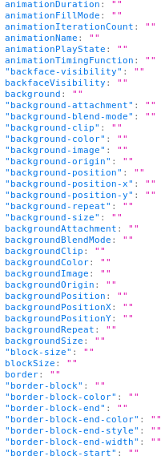


### Модифікація значень форми
```html
<form action="">
  <input type="text">
</form>
```
```js
var aList = document.querySelectorAll('input');
for(var i = 0; i < aList.length; i++){
	aList[i].value = "qwe";
}
```


## Додавання і видалення елементів


### document.write
Метод document.write - один з найбільш древніх методів додавання тексту до документа.

У нього є істотні обмеження, тому він використовується рідко, але по своїй суті він абсолютно унікальний і іноді, хоч і рідко, може бути корисний.


### document.write
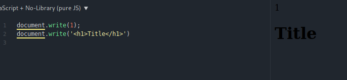


### add element
У HTML-документах створює зазначений в аргументі елемент або HTMLUnknownElement, якщо елемент невідомий.

```js
var element = document.createElement(tagName, [options]);

var newDiv = document.createElement("div");
```


### Додавання дочірнього елементу. appendChild
Додає елемент в кінець списку дочірніх елементів батька. Якщо елемент вже існує він видаляється з поточного батька і вставляється заново. 

```js
var child = element.appendChild(child);
```


### Додавання дочірнього елементу. insertBefore
Метод Node.insertBefore () додає елемент в список дочірніх елементів батька перед зазначеним елементом. 
```js
var insertedElement = parentElement.insertBefore(newElement, referenceElement);
```


### Видалення дочірнього елементу
Видаляє дочірній елемент з DOM. Повертає видалений елемент. 

```js
var d = document.getElementById("top");
var d_nested = document.getElementById("nested");
var throwawayNode = d.removeChild(d_nested);
```


# Events


### Events
Всі зміни, які відбуваються на Web-сторінки, пов'язані з роботою браузера або маніпуляціями користувача з клавішами миші або клавіатури, називаються подіями. Для вказівки дій, які необхідно зробити в зв'язку з появою того або іншої події, використовуються обробники подій. поні вказуються у вигляді назви події з додаванням префікса on. 


### Події браузера
- onLoad - викликається за події Load: завантаження web-сторінки;
- onUnload - викликається за події Unload: вивантаження Web сторінки при завершенні роботи зі сторінкою або при переході на іншу сторінку.


### Події зв'язані із мишкою
- onMouseover - викликається за події Mouseover : наведення вказівника мишки на об'єкт;
- onMousemove - викликається за події Mousemove: вказівник мишки поміщається на об'єкт або рухається по об'єкту;
- onMousedown - викликається за події Mousedown: натискання лівої або правої клавіші мишки;
- onMouseup - викликається за події Mouseup: віджимання лівої клавіші мишки;
- onClick - викликається за події Click: клацніть мишкою (натиснення і віджимання лівої клавіші мишки);


### Події зв'язані із мишкою
```js
document.onclick = clickHandler;

function clickHandler(event) {
	//some code here
}
```


### Приклад