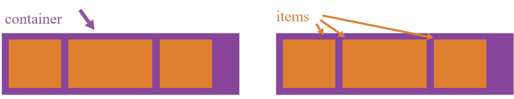
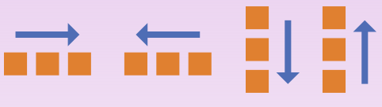
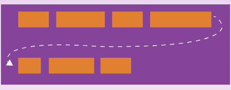
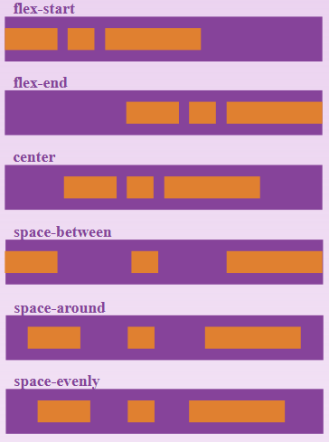
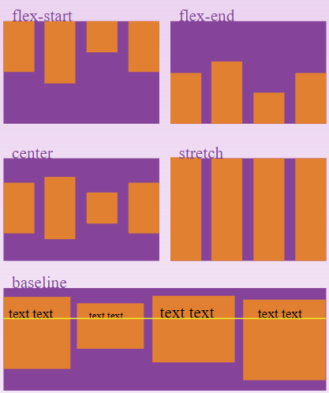
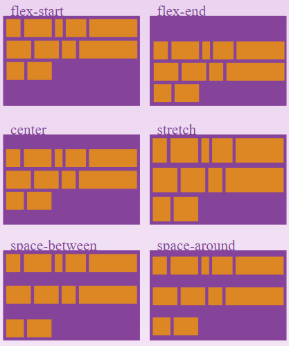
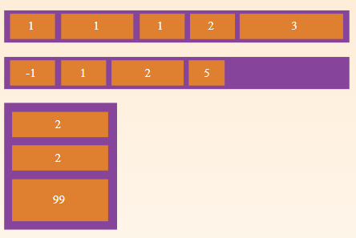
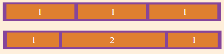
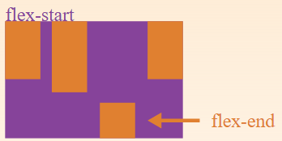

# CSS Flexible Box Layout Module


## Що і навіщо?


### Що таке Flexbox
CSS flexbox (Flexible Box Layout Module) - модуль макета гнучкого контейнера - являє собою спосіб компонування елементів. 


### Навіщо потрібен Flexbox?
- Розташовувати елементи в одному з чотирьох напрямків: зліва направо, справа наліво, зверху вниз або знизу вгору;
- Перевизначати порядок відображення елементів;
- Автоматично визначати розміри елементів таким чином, щоб вони вписувалися в доступний простір;
- Вирішувати проблему з горизонтальним і вертикальним вирівнюванням;
- Створювати колонки однакової висоти;
- Створювати притиснутий до низу сторінки підвал сайту.


## Flex - контейнер. Flex - блоки.


### Flex - контейнер. Flex - блоки.
Flexbox складається з flex-контейнера - батьківського контейнера і flex-елементів - дочірніх блоків. Дочірні елементи можуть вибудовуватися в рядок або стовпчик, а вільний простір розподіляється між ними різними способами.


### Flex - контейнер. Flex - блоки.



## Flex - контейнер


### Flex - контейнер
- Flex-контейнер встановлює новий гнучкий контекст форматування для його вмісту.
- Модель flexbox-розмітки пов'язана з певним значенням CSS-властивості display батьківського html-елемента, що містить в собі дочірні блоки.


### Display
```css
.conteiner{
	display: flex; /* inline-flex */
}
```


### flex-direction
Властивість визначає, яким чином flex-елементи укладаються у flex-контейнері, задаючи напрямок головної осі flex-контейнера. Вони можуть розташовуватися в двох головних напрямках - горизонтально, як рядки або вертикально, як колонки. Головна вісь за замовчуванням йде зліва направо. Поперечна - зверху вниз.


### flex-direction



### flex-direction
```css
.container {
	flex-direction: row | row-reverse | column | column-reverse;
}
```


### flex-wrap
За замовчуванням елементи flex будуть намагатися поміститися на одній лінії. Ви можете змінити це і дозволити елементам переміщатися, коли потрібно.


### flex-wrap



### flex-wrap
```css
.container{
	flex-wrap: nowrap | wrap | wrap-reverse;
  }
```


### flex-flow
Це скорочення flex-direction та flex-wrap, які разом визначають ці властивості. 
```css
flex-flow: <‘flex-direction’> || <‘flex-wrap’>
```


### justify-content
Властивість вирівнює flex-елементи по ширині flex-контейнера, розподіляючи вільний простір, не зайняте flex-елементами.


### justify-content



### justify-content
```css
.container {
	justify-content: flex-start | flex-end |
					 center | space-between | space-around 
					 | space-evenly;
  }
```


### align-items
Властивість вирівнює flex-елементи по перпендикулярній осі (по висоті).


### align-items



### align-items
```css
.container {
	align-items: flex-start | flex-end |
				 center | baseline | stretch;
  }
```


### align-content
Властивість вирівнює рядки flex-елементів по вертикалі у flex-контейнері, дозволяючи управляти вільним простором. Властивість працює тільки в разі, якщо дозволений перенесення рядків і вказано напрямок.


### align-content



### align-content
```css
.container {
	align-content: flex-start | flex-end | center |
				   space-between | space-around | stretch;
  }
```


## Flex - елементи


### order
Властивість визначає порядок, в якому flex-елементи відображаються всередині flex-контейнера. За замовчуванням для всіх flex-елементів заданий порядок order: 0; і вони слідують один за одним у міру додавання у flex-контейнер.


### order



### order
```css
.item {
    order: <integer>
}
```


### flex-grow
Властивість визначає коефіцієнт збільшення ширини flex-елемента щодо інших flex-елементів.


### flex-grow



### flex-grow
```css
.item {
    flex-grow: <number>
}
```


### flex-shrink
Властивість вказує коефіцієнт зменшення ширини flex-елемента щодо інших flex-елементів. Працює тільки якщо для елемента задана ширина за допомогою властивості flex-basis або width.


### flex-shrink
```css
.item {
    flex-shrink: <number>
}
```


### flex-basis
Властивість дозволяє задати базову ширину flex-елемента, щодо якої буде відбуватися розтягнення flex-grow або звуження flex-shrink елемента. 


### flex-basis
```css
.item {
    flex-basis: <length> | auto; /* default auto */
}
```


### flex
Властивість є скороченим записом властивостей flex-grow, flex-shrink і flex-basis. Значення за замовчуванням: flex: 0 1 auto ;. Можна вказувати як одне, так і всі три значення властивостей.


### flex
```css
.item {
    flex: none | [ <'flex-grow'> <'flex-shrink'>? || <'flex-basis'> ]
}
```


### align-self
Властивість відповідає за вирівнювання окремо взятого flex-елемента по висоті flex-контейнера. Перевизначає вирівнювання, заданий align-items.


### align-self



### align-self
```css
.item {
align-self: auto | flex-start |
                flex-end | center |
                baseline | stretch;
}
```


## Flexbox Froggy

[Flexbox Froggy](http://flexboxfroggy.com/#uk)