# Вступ до професії Front-end developer. HTML


## Front-end vs Back-end vs Full Stack


### Front-end vs Back-end vs Full Stack


### Front-end

В програмній інженерії терміни «front end» та «back end» розрізняють за принципом розділення відповідальності між рівнем представлення та рівнем доступу до даних відповідно.

Front end — це  інтерфейс для взаємодії між користувачем і back end. Front end та back end можуть бути розподілені між однією або кількома системами.


### Back-end

**Бек-енд розробник** (з англ. Back-end (зворотний бік) developer) - це фахівець, який займається програмно-адміністративною частиною веб-додатків, внутрішнім змістом системи, серверними технологіями - базою даних, архітектурою, програмної логікою.


### Full Stack

Основна ідея в тому, що Full Stack розробник працює крос-функціонально з повним стеком технологій, і з Front-end і з Back-end. Ідею Full Stack розробників стали активно просувати в компанії Facebook кілька років тому.

Дехто каже, що робота з серверної і клієнтської частиною сайту відкривають більше можливостей. Але ця робота не без викликів. Full Stack розробник повинен розбиратися і в серверній і в клієнтської частини сайту однаково добре.


### Верстальщик vs Front-end developer

Коротко: ***HTML-верстальник*** - це той, хто робить з графічного макету HTML + CSS сторінку. Без занурення в бекенд.

***Фронтенд-розробник** - це той, хто може крім цього писати на JavaScript, знає фреймворки і бібліотеки, знає і застосовує AJAX і CORS, вміє писати заглушки для AJAX запитів. Тобто з частковим зануренням в бекенд.


### Що потрібно знати Front-end розробнику

[Developer roadmap](https://github.com/kamranahmedse/developer-roadmap)


## HTML


### HTML

**HTML** (Ейч-Ті-Ем-Ел, англ. HyperText Markup Language, укр. Мова розмітки гіпертекстових документів) — стандартна мова розмітки веб-сторінок в Інтернеті. Більшість веб-сторінок створюються за допомогою мови HTML (або XHTML). Документ HTML оброблюється браузером та відтворюється на екрані у звичному для людини вигляді.

**HTML** - це мова розмітки документів. Він застосовується в усьому світі. Браузер інтерпретує код HTML для відображення його на комп'ютері, планшеті або телефоні.

**HTML** - це всього навсього текстовий документ із специфічною структурою.


### HTML

Для розробки HTML - сторінок достатьно простого текстового редактора, накштаут, блокнота і веб - браузера.

Створіть текстовий документ із наступним вмістом:

```html
<p>Hello World!!!</p>
```

Збережіть його з розширенням .html, наприклад, index.html і відкрийте за допомогою браузера.

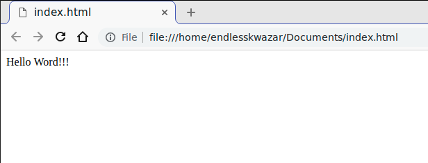


### Історія розвитку HTML

Мова HTML був розроблений британським вченим Тімом Бернерс-Лі приблизно в 1986-1991 роках в стінах ЦЕРНу в Женеві в Швейцарії. HTML створювався як мова для обміну науковою і технічною документацією, придатний для використання людьми, які не є фахівцями в області верстки. HTML успішно справлявся з проблемою складності SGML шляхом визначення невеликого набору структурних і семантичних елементів - дескрипторів. Дескриптори також часто називають «тегами». За допомогою HTML можна легко створити відносно простий, але красиво оформлений документ. Крім спрощення структури документа, в HTML внесена підтримка гіпертексту. Мультимедійні можливості були додані пізніше.


### World Wide Web Consortium (W3C)

**Консорціум Всесвітньої павутини** (англ. World Wide Web Consortium, W3C) — головна міжнародна організація, що розробляє й впроваджує технологічні стандарти для всесвітньої павутини. Заснована 1994 року Тімом Бернерсом-Лі,- винахідником всесвітньої павутини, котрий її і очолює.

Місія W3C:
> Повністю розкрити потенціал Всесвітньої павутини, шляхом створення протоколів і принципів, що гарантують довгостроковий розвиток Мережі».


### Коротко про текстові редактори

Популярні текстові редактори коду для front-end програмування: [Sublime Text](https://www.sublimetext.com/download); [Atom](https://atom.io/); [Visual Studio Code](https://code.visualstudio.com/).

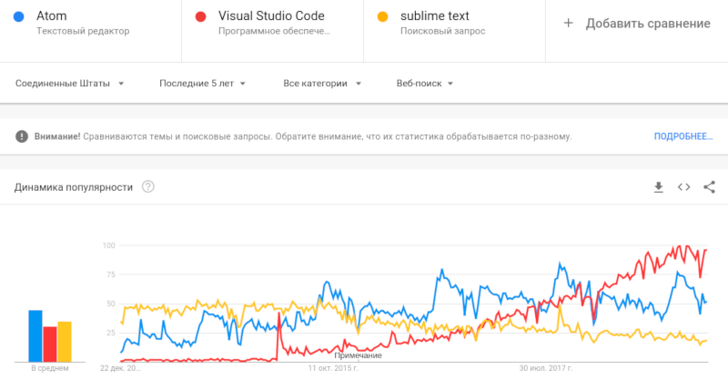


## Тег як основний будівельний блок HTML - сторінки


### Тег як основний будівельний блок HTML - сторінки

HTML-теги - основа мови HTML. Теги використовуються для розмежування початку і кінця елементів в розмітці.

HTML - тег складається із:
- Відкриваючого тега
- Атрибутів(пари ключ значення)
- Вмісту(контента)
- Закриваючого тега


### Тег як основний будівельний блок HTML - сторінки


### Тег як основний будівельний блок HTML - сторінки

Хоча більшість тегів відповідають описаній вище структурі, існують теги, які наприклад
не містять закриваючого тега, такі теги називаютья непранимим.

Отже, теги можуть бути парними(ті, що містять закриваючий і відкриваючий тег) і
непарними(які не містять закриваючого тега)


### Тег як основний будівельний блок HTML - сторінки

Приклад парних тегів:

```html
&lt;p&gt;&lt;/p&gt;
&lt;div&gt;&lt;/div&gt;
&lt;span&gt;&lt;/span&gt;
```

Приклад непарних тегів

```html
&lt;hr /&gt;
&lt;br &gt;
```


### Блочні VS Строкові

Ми вже знаємо, що теги можуть бути парними і непарними. Ще теги можуть бути строковими і блочнимим.

**Блочними** називаються теги, які займають всю доступну їм ширину і починаються з нового рядка.

**Строкові** елементи займають ширину необхідну для їх відображення і не починаються з нового рядка.


### Блочні VS Строкові

В якості прикладу блочного тега приведемо тег p. Наступний код:
```
<p style="border: solid 1px blue;">This is one line</p>
<p style="border: solid 1px red;">This is second line</p>
```
Приведе до наступного результату:
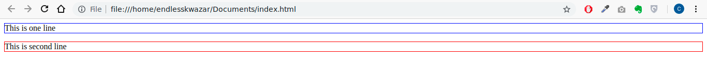


### Блочні VS Строкові
В якості прикладу строкового тега приведемо span. Наступний код:
```
<span style="border: solid 1px blue;">This is one line</span>
<span style="border: solid 1px red;">This is second line</span>
```
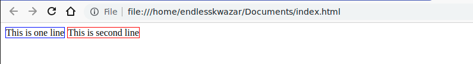


## Основні HTML - теги


### Основні HTML - теги
Для того щоб розглянути основні HTML теги, ми застосуємо наступну класифікацію:

- Теги тексту
- Теги форматування
- Теги заголовків
- Силки(Посилання)
- Зоображення
- Теги списків
- Теги таблиці
- Теги форм і користувацьких елементів
- Інші теги


## Теги тексту


### p

Визначає текстовий абзац. Тег **p** є блоковим елементом, завжди починається з нового рядка, абзаци тексту йдуть один за одним розділяються між собою відбиттям. Величиною відбиття можна керувати за допомогою стилів. Якщо закриває тега немає, вважається, що кінець абзацу збігається з початком наступного блокового елемента.


### p

```html
&lt;p&gt;Some block of code&lt;/p&gt;
&lt;p&gt;Some other block of code&lt;/p&gt;
&lt;p&gt; Will be closed before div
&lt;div&gt;&lt;/div&gt;
```


### span

Тег **span** призначений для визначення малих елементів документа. На відміну від блокових елементів, таких як table, p або div, за допомогою тега span можна виділити частину інформації всередині інших тегів і встановити для неї свій стиль. Наприклад, всередині абзацу (тега p) можна змінити колір і розмір першої літери, якщо додати початковий і кінцевий тег span і визначити для нього стиль тексту.


### span

```html
&lt;p&gt;Some text &lt;span&gt;some other text related to main&lt;/span&gt;&lt;/p&gt;
```
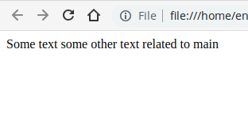


## Теги форматування


### u

Додає підкреслення до тексту. Цей тег засуджується специфікацією HTML, натомість рекомендується використовувати стилі. Тег u - парний, строковий.
```html
&lt;p&gt;Some tex &lt;u&gt;this text is underlined&lt;/u&gt;&lt;/p&gt;
```
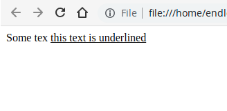


### i

Встановлює курсивне накреслення шрифту. Допустимо використовувати цей тег спільно з іншими тегами, які визначають накреслення тексту. Тег парний, строковий.
```html
&lt;p&gt;This is some text &lt;i&gt;this text is italic&lt;/i&gt;&lt;/p&gt;
```


### b

Встановлює жирне накреслення шрифту. Допустимо використовувати цей тег спільно з іншими тегами, які визначають накреслення тексту. Тег парний, строковий.
```html
&lt;p&gt;This is text &lt;i&gt;&lt;u&gt;&lt;b&gt;itelic underlined bold&lt;/b&gt;&lt;/u&gt;&lt;/i&gt;&lt;/P&gt;
```
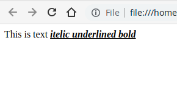


### strong

Тег **strong** призначений для акцентування тексту. Браузери відображають такий текст жирним шрифтом.

Тег **strong** визначає важливість зазначеного тексту. Тег **b** призначений для виділення тексту без додання йому особливої ​​важливості. Візуально обидва тега однакові, вони виділяють текст напівжирним.

Найкраще відмінності цих тегів будуть помітні людям, які використовують спеціальні настройки ОС, зокрема, сліпим і зі слабким зором. Коли вони включають функцію читання тексту, то «говорилка» буде інтонацією виділяти слова з тегом **strong**. Те ж саме стосується і тегів **em** і **i**.


### small

Тег **small** зменшує розмір шрифту на одиницю в порівнянні зі звичайним текстом. В HTML розмір шрифту вимірюється в умовних одиницях від 1 до 7, середній розмір тексту, що використовується за замовчуванням, прийнятий 3. Таким чином, додавання тега **small** зменшує текст на одну умовну одиницю. Допускається застосування вкладених тегів **small**, при цьому розмір шрифту буде менше з кожним вкладеним рівнем, але не може бути менше, ніж 1.


### small

```html
&lt;p&gt;Text &lt;small&gt;smaller &lt;small&gt;smaller&lt;/small&gt;&lt;/small&gt;&lt;/p&gt;
```


## Теги заголовків


### Теги заголовків

HTML пропонує шість заголовків різного рівня, які показують відносну важливість секції, розташованої після заголовка. Так, тег **h1** представляє собою найбільш важливий заголовок першого рівня, а тег **h6** служить для позначення заголовка шостого рівня і є найменш значним. За замовчуванням, заголовок першого рівня відображається найбільшим шрифтом жирного накреслення, заголовки подальшого рівня за розміром менше. Теги **h1**, ..., **h6** відносяться до блокових елементів, вони завжди починаються з нового рядка, а після них інші елементи відображаються на наступному рядку. Крім того, перед заголовком і після нього додається порожній простір.

Тег h - блочний, парний.


### Теги заголовків

```html
&lt;h1&gt;Title 1&lt;/h1&gt;
&lt;h2&gt;Title 2&lt;/h2&gt;
&lt;h3&gt;Title 3&lt;/h2&gt;
&lt;h4&gt;Title 4&lt;/h3&gt;
&lt;h5&gt;Title 5&lt;/h4&gt;
&lt;h6&gt;Title 6&lt;/h5&gt;
```


## Силки(Посилання)


### a

Тег **a** є одним з важливих елементів HTML і призначений для створення посилань. Залежно від присутності атрибутів name або href тег **a** встановлює посилання або якір. Якорем називається закладка всередині сторінки, яку можна вказати в якості мети посилання. При використанні посилання, яка вказує на якір, відбувається перехід до закладки всередині веб-сторінки.


### Anchor

Якор:

```html
&lt;a href=&quot;#intro&quot;&gt;

&lt;div id=&quot;intro&quot;&gt;
    Some text
&lt;/div&gt;
```


### Посилання

Посилання на локальний ресурс:
```html
&lt;a href=&quot;/pages/about.html&quot;&gt;Link&lt;/a&gt;
```
Посилання на зовнішній ресурс:
```html
&lt;a href=&quot;http://google.com.ua&quot;&gt;Link&lt;/a&gt;
```


## Зоображення


### img

Тег **img** призначений для відображення на веб-сторінці зображень в графічному форматі GIF, JPEG або PNG. Адреса файлу з картинкою задається через атрибут src. Якщо необхідно, то малюнок можна зробити посиланням на інший файл, помістивши тег **img** в контейнер **a**. При цьому навколо зображення відображається рамка, яку можна прибрати, додавши атрибут border = "0" в тег **img**.

img - строковий, закриваючий тег є не обов'язковим.


### img

Атрибут src може містити абсолютний, відносний, або посилання на інший ресурс:

- img/img.png
- C:\files\img.png
- http://someweb.com/img/img.png


## Теги списків


### ul

Тег **ul** встановлює маркований список. Кожен елемент списку повинен починатися з тега **li**. Якщо до тегу **ul** застосовується таблиця стилів, то елементи **li** успадковують ці властивості.

Тег ul - блочний, парний. li - блочний, парний.


### ul

```html
&lt;ul&gt;
    &lt;li&gt;one item&lt;/li&gt;
    &lt;li&gt;second item&lt;/li&gt;
&lt;/ul&gt;
```


### ol

Тег **ol** встановлює нумерований список. Кожен елемент списку повинен починатися з тега **li**. Якщо до тегу **ol** застосовується таблиця стилів, то елементи **li** успадковують ці властивості.


### ol

```html
&lt;ol&gt;
    &lt;li&gt;first item&lt;/li&gt;
    &lt;li&gt;second item&lt;/li&gt;
&lt;/ol&gt;
```

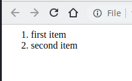


## Теги таблиці


### table

Таблицю HTML визначається тегом **table**.

Кожен рядок таблиці визначається тегом **tr**. Заголовок таблиці визначається тегом **th**. За замовчуванням заголовки таблиць виділено жирним шрифтом і центровані. Таблиця data / cell визначається тегом **td**.


### table


### table

```html
&lt;table&gt;
&lt;tr&gt;
    &lt;th&gt;Header 1&lt;/th&gt;
    &lt;th&gt;Header 2&lt;/th&gt;
&lt;tr&gt;
&lt;tr&gt;
    &lt;td&gt;Cell 1&lt;/td&gt;
    &lt;td&gt;Cell 2&lt;/td&gt;
&lt;/tr&gt;
&lt;/table&gt;
```


## Теги форм і користувацьких елементів


### form

Тег **form** встановлює форму на веб-сторінці. Форма призначена для обміну даними між користувачем і сервером. Область застосування форм не обмежена відправкою даних на сервер, за допомогою клієнтських скриптів можна отримати доступ до будь-якого елементу форми, змінювати його і застосовувати на власний розсуд.

Допускається всередину контейнера **form** поміщати інші теги, при цьому сама форма ніяк не відображається на веб-сторінці, видно тільки її елементи і результати вкладених тегів.

```html
<form>
</form>
```


### input

Тег **input** є одним з різнобічних елементів форми і дозволяє створювати різні елементи інтерфейсу і забезпечити взаємодію з користувачем. Головним чином **input** призначений для створення текстових полів, різних кнопок, перемикачів і прапорців. Хоча елемент **input** не потрібно поміщати всередину контейнера **form**, що визначає форму, але якщо введені користувачем дані повинні бути відправлені на сервер, де їх обробляє серверна програма, то вказувати **form** обов'язково. Те ж саме відбувається і в разі обробки даних за допомогою клієнтських додатків, наприклад, скриптів на мові JavaScript.


### input

Основний атрибут тега **input**, що визначає вид елемента - type. Він дозволяє задавати такі елементи форми:
- текстове поле (text)
- поле з паролем (password)
- перемикач (radio)
- прапорець (checkbox)
- кнопка (button) 
- кнопка для відправки форми (submit)
- кнопка для очищення форми (reset)
- поле для відправки файлу (file)


### input

```html
&lt;h5&gt;Input[type = text]&lt;/h5&gt;
&lt;input type=&quot;text&quot;&gt;
&lt;h5&gt;Input[type = password]&lt;/h5&gt;
&lt;input type=&quot;password&quot;&gt;
&lt;h5&gt;Input[type = password]&lt;/h5&gt;
&lt;input type=&quot;radio&quot; name=&quot;is&quot;&gt;
&lt;input type=&quot;radio&quot; name=&quot;is&quot;&gt;
&lt;h5&gt;Input[type = password]&lt;/h5&gt;
&lt;input type=&quot;checkbox&quot;&gt;
&lt;input type=&quot;checkbox&quot;&gt;
&lt;h5&gt;Input[type = button]&lt;/h5&gt;
&lt;input type=&quot;button&quot; value=&quot;Click&quot;&gt;
&lt;h5&gt;Input[type = submit]&lt;/h5&gt;
&lt;input type=&quot;submit&quot;&gt;
&lt;h5&gt;Input[type = reset]&lt;/h5&gt;
&lt;input type=&quot;reset&quot;&gt;
&lt;h5&gt;Input[type = file]&lt;/h5&gt;
&lt;input type=&quot;file&quot;&gt;
```


### input

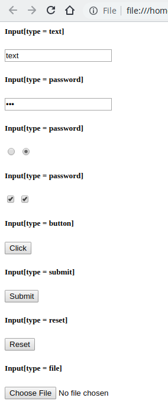


### select

Тег **select** дозволяє створити елемент інтерфейсу у вигляді списку, а також список з одним або множинним вибором, як показано далі. Кінцевий вигляд залежить від використання атрибута size тега **select**, який встановлює висоту списку. Ширина списку визначається самим широким текстом, зазначеним в тезі **option**, а також може змінюватися за допомогою стилів. Кожен пункт створюється за допомогою тега **option**, який повинен бути вкладений в контейнер **select**. Якщо планується відправляти дані списку на сервер, то потрібно помістити елемент **select** всередину форми. Це також необхідно, коли до даних списку йде звернення через скрипти.


### select

```html
&lt;select&gt;
  &lt;option&gt;first option&lt;/option&gt;
  &lt;option&gt;second option&lt;/option&gt;
&lt;/select&gt;
```

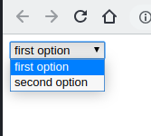


### textarea

Поле **textarea** є елементом форми для створення області, в яку можна вводити кілька рядків тексту. На відміну від тега **input** в текстовому полі допустимо робити переноси рядків, вони зберігаються при відправці даних на сервер.

Між тегами **textarea** і **/ textarea** можна помістити будь-який текст, який буде відображатися всередині поля.


### textarea

```html
&lt;textarea&gt;
default text
&lt;/textarea&gt;
```

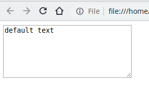


## Інші теги


### br

Тег **br** встановлює новий рядок в тому місці, де цей тег знаходиться. На відміну від тега абзацу **p**, використання тега **br** Не додає порожній відступ перед рядком.

```
Текст
Текст2
Текст3 <br>
Текст4 
```


### hr

Малює горизонтальну лінію, яка за своїм виглядом залежить від використовуваних параметрів, а також браузера. Тег **hr** відноситься до блокових елементів, лінія завжди починається з нового рядка, а після неї всі елементи відображаються на наступному рядку.

Тег hr - блочний, непарний

```html
Title 1 <hr /> Title 2 <hr />
```


## Валідна структура HTML - документа


### Валідна структура HTML - документа

Валідатор (калька з англ. validator) — комп'ютерний сервіс, програма, об'єкт, функція або оператор, який/яка перевіряє відповідність деяких даних вимогам до типу, вмісту, формату або синтаксису. Процес перевірки називають валідацію, а дані, що відповідають вимогам — валідними.

Валідатори файлів звичайно дозволяють перевірити вміст файлу на відповідність вимогам формату. Популярність валідаторів файлів визначається складністю окремих форматів (XML, HTML, SGML тощо) і можливостями автоматизації процесів їх перевірки.


### Валідна структура HTML - документа

Створемо файл index.html з наступним вмістом:

```html
&lt;h1&gt;Hello World&lt;/h1&gt;
&lt;p&gt;This is hello world html page!!!&lt;/p&gt;
```


### Валідна структура HTML - документа

Перейдимо на [Markup Validation Service](https://validator.w3.org/#validate_by_upload) 
і завантажимо створений документ, пвсля чого натиснимо кнопку Check:

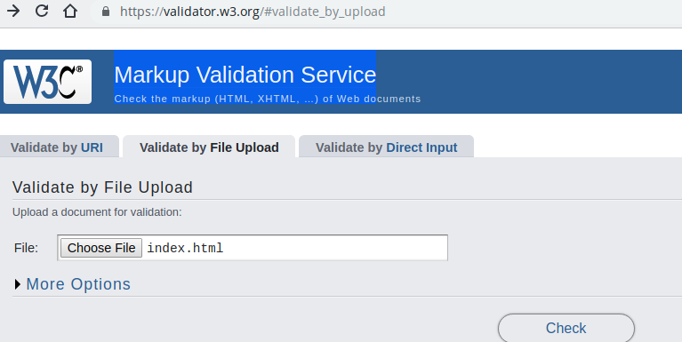


### Валідна структура HTML - документа

Результат виявить наступні помилки в документі:

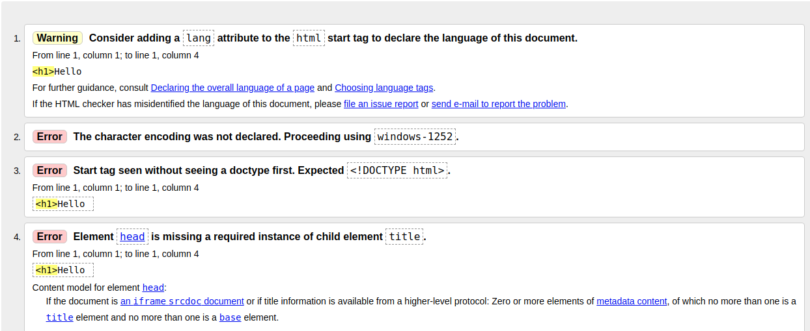


### Валідна структура HTML - документа

Справа в тім, що html - документ, окрім контенту, який ми хочемо представити містить
певну структуру. Ця структура:

```html
&lt;!DOCTYPE html&gt;
&lt;html lang=&quot;en&quot;&gt;
&lt;head&gt;
    &lt;meta charset=&quot;UTF-8&quot;&gt;
    &lt;meta name=&quot;viewport&quot; content=&quot;width=device-width, initial-scale=1.0&quot;&gt;
    &lt;meta http-equiv=&quot;X-UA-Compatible&quot; content=&quot;ie=edge&quot;&gt;
    &lt;title&gt;Document&lt;/title&gt;
&lt;/head&gt;
&lt;body&gt;
    
&lt;/body&gt;
&lt;/html&gt;
```


### Валідна структура HTML - документа

Згідно специфікаціям HTML і XHTML тег DOCTYPE (що означає «оголошення типу документа») повідомляє валідатора, яку саме версію (X) HTML ви використовуєте в своїй сторінці. Цей тег повинен завжди перебувати в першому рядку кожної сторінки. Тег DOCTYPE - ключовий компонент web-сторінок, які претендують на відповідність стандартам: без нього ваш код і CSS не пройдуть перевірку валідатором.


### Валідна структура HTML - документа

Тег **html** є контейнером, який містить в собі весь вміст веб-сторінки, включаючи теги **head** і **body**. Хто відкриває і закриває теги **html** в документі необов'язкові, але хороший стиль диктує неодмінна їх використання. Як правило, тег **html** йде в документі другим, після визначення типу документа (Document Type Definition, DTD), що встановлюється через елемент **! DOCTYPE**. Закриває тег **html** повинен завжди стояти в документі останнім.


### Валідна структура HTML - документа

Тег **head** призначений для зберігання інших елементів, мета яких - допомогти браузеру в роботі з даними. Також всередині контейнера **head** знаходяться метатеги, які використовуються для зберігання інформації призначеною для браузерів і пошукових систем. Наприклад, механізми пошукових систем звертаються до метатегах для отримання опису сайту, ключових слів та інших даних.

Вміст тега **head** не відображається безпосередньо на веб-сторінці, за винятком тега **title** встановлює заголовок вікна веб-сторінки.


### Валідна структура HTML - документа

Елемент **body** призначений для зберігання змісту веб-сторінки (контенту), що відображається у вікні браузера. Інформацію, яку слід виводити в документі, слід розташовувати саме всередині контейнера **body**. До такої інформації належить текст, зображення, теги, скрипти JavaScript і т.д.


### Валідна структура HTML - документа

```html
&lt;!DOCTYPE html&gt;
&lt;html lang=&quot;en&quot;&gt;
&lt;head&gt;
    &lt;meta charset=&quot;UTF-8&quot;&gt;
    &lt;meta name=&quot;viewport&quot; content=&quot;width=device-width, initial-scale=1.0&quot;&gt;
    &lt;meta http-equiv=&quot;X-UA-Compatible&quot; content=&quot;ie=edge&quot;&gt;
    &lt;title&gt;Document&lt;/title&gt;
&lt;/head&gt;
&lt;body&gt;
    &lt;h1&gt;Hello World&lt;/h1&gt;

&lt;p&gt;This is hello world html page!!!&lt;/p&gt;
&lt;/body&gt;
&lt;/html&gt;
```


### Валідна структура HTML - документа


## HTML 5


### Семантична структура до HTML5

Структура документу, тобто семантична структура, що знаходиться між **body** і **/body**, — основа представлення сторінки. В HTML4 для опису структури документу використовується форма запису із розділів та підрозділів. Розділ визначається за допомогою елемента (**div**), в який включаються елементи заголовків (**h1**, **h2**, **h3**, **h4**, **h5**, або **h6**), які, власне, і слугують заголовками секцій чи підсекцій. Взаєморозміщення даних елементів утворює структуру документу та будує його схему.


### Семантична структура до HTML5

Наприклад:
```html
&lt;div class=&quot;section&quot; id=&quot;products&quot;&gt;
    &lt;ul&gt;
        &lt;li&gt;Product 1&lt;/li&gt;
        &lt;li&gt;Product 2&lt;/li&gt;
    &lt;/ul&gt;
&lt;/div&gt;
&lt;div class=&quot;section&quot; id=&quot;reviews&quot;&gt;
&lt;p&gt;Good product&lt;/p&gt;
&lt;/div&gt;
```


### Нові семантичні теги HTML5

Семантичні елементи HTML5 описують свій сенс і презначення як для браузерів, так і для веб-розробників.
Стандарт HTML5 надав нові елементи для структурування, угруповання контенту і розмітки текстового вмісту:

- header
- nav
- article
- section
- aside
- footer
- adress
- main


### Нові семантичні теги HTML5

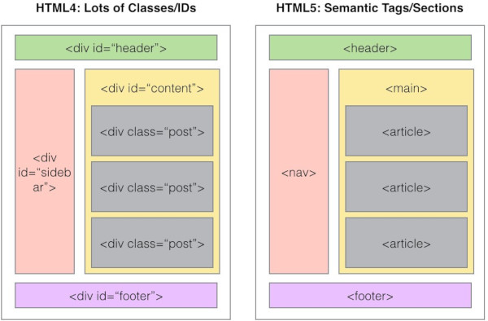


### header

Групує вступні і навігаційні елементи, не є обов'язковим. Може містити заголовки, обертати зміст розділу сторінки, форму пошуку або логотип. У HTML-документі може міститися одночасно кілька елементів **header** і вони можуть розташовуватися в будь-якій частині сторінки.
```html
&lt;header&gt;
  &lt;h1&gt;Site description&lt;/h1&gt;
  &lt;nav&gt;
    &lt;ul&gt;
      &lt;li&gt;&lt;a href=&quot;&quot;&gt;About&lt;/a&gt;
      &lt;li&gt;&lt;a href=&quot;&quot;&gt;Forum&lt;/a&gt;
      &lt;li&gt;&lt;a href=&quot;&quot;&gt;Download&lt;/a&gt;
    &lt;/ul&gt;
  &lt;/nav&gt;
&lt;/header&gt;
```
Елемент **header** не можна поміщати всередину елементів **footer**, **address** або іншого елемента **header**.


### nav

Призначений для створення блоку навігації веб-сторінки або всього веб-сайту, при цьому не обов'язково повинен перебувати всередині **header**. На сторінці може бути кілька елементів **nav**. Чи не замінює теги **ul** або **ОL**, він просто їх обрамляє. Не всі групи посилань на сторінці повинні бути обгорнуті **nav**, цей елемент призначений в першу чергу для розділів, які складаються з головних навігаційних блоків.

```html
&lt;nav&gt;
  &lt;ul&gt;
    &lt;li&gt;&lt;a&gt;...&lt;/a&gt;&lt;/li&gt;
    &lt;li&gt;&lt;a&gt;...&lt;/a&gt;&lt;/li&gt;
    &lt;li&gt;&lt;a&gt;...&lt;/a&gt;&lt;/li&gt;
  &lt;/ul&gt;
&lt;/nav&gt;
```


### nav

Як елементи панелі навігації можна використовувати не тільки елементи списків:
```html
&lt;nav&gt;
  &lt;p&gt;&lt;a href=&quot;&quot;&gt;...&lt;/a&gt;&lt;/p&gt;
  &lt;p&gt;&lt;a href=&quot;&quot;&gt;...&lt;/a&gt;&lt;/p&gt;
&lt;/nav&gt;
```
Також можна додавати заголовки всередину елемента:
```html
&lt;nav&gt;
  &lt;h2&gt;...&lt;/h2&gt;
    &lt;ul&gt;
      &lt;li&gt;&lt;a&gt;...&lt;/a&gt;&lt;/li&gt;
      &lt;li&gt;&lt;a&gt;...&lt;/a&gt;&lt;/li&gt;
      &lt;li&gt;&lt;a&gt;...&lt;/a&gt;&lt;/li&gt;
    &lt;/ul&gt;
&lt;/nav&gt;
```


### article

Тег article задає зміст сайту на кшталт новини, статті, записи блогу, форуму або ін.
```html
&lt;article&gt;
  &lt;header&gt;
    &lt;h2&gt;...&lt;/h2&gt;
  &lt;/header&gt;
  &lt;p&gt;...&lt;/p&gt;
  &lt;footer&gt;
  Опубликовано в категории&lt;a href=&quot;&quot;&gt;Музыка&lt;/a&gt;.
    &lt;a href=&quot;&quot;&gt;0 комментариев&lt;/a&gt;
  &lt;/footer&gt;
&lt;/article&gt;
```


### section

Елемент являє собою універсальний розділ документа. Групує тематичне вміст і зазвичай містить заголовок. Не є блоком-обгорткою, для цих цілей доречніше використовувати елемент **div**. Як вміст може виступати зміст, розділи наукових публікацій, програма заходу. Домашня сторінка сайту також може бути поділена на секції - блок вступної інформації, новини і контакти. Елемент рекомендується використовувати тільки в тому випадку, якщо вміст елемента буде явно зазначено в схемі документа.


### section
```html
&lt;article&gt;
  &lt;h1&gt;...&lt;/h1&gt;
    &lt;section&gt;
      &lt;h2&gt;...&lt;/h2&gt;
      &lt;p&gt;...&lt;/p&gt;
    &lt;/section&gt;
    &lt;section&gt;
      &lt;h2&gt;...&lt;/h2&gt;
      &lt;p&gt;...&lt;/p&gt;
    &lt;/section&gt;
    &lt;p&gt;...&lt;/p&gt;
&lt;/article&gt;
```


### aside

Групує вміст, який пов'язаний з навколишнім його контентом безпосередньо, але не можу бути окремим (тобто, видалення цього блоку не вплине на розуміння основного вмісту). Найчастіше елемент позиціонується як бічна колонка (як в книгах) і включає в себе групу елементів: **nav**, цифрові дані, цитати, рекламні блоки, архівні записи. Не підходить для блоків, просто позиціонуються в стороні.

```html
&lt;aside&gt;
  &lt;h2&gt;...&lt;/h2&gt;
  &lt;p&gt;...&lt;/p&gt;
&lt;/aside&gt;
```


### footer

Являє собою нижній колонтитул містить його секції або кореневого елемента. Зазвичай містить інформацію про автора статті, дані про копірайт і т.д. Якщо використовується як колонтитул всієї сторінки, вміст доповнюється відомостями про авторські права, посиланнями на умови використання, контактну інформацію, посиланнями на пов'язане вміст і т.п.

В одному веб-документі може бути кілька елементів **footer**. Як кожна сторінка, так і кожна стаття може мати свій елемент **footer**, більш того, **footer** можна помістити в елемент **blockquote**, щоб вказати джерело цитування.


### footer
```html
&lt;footer&gt;
  &lt;address&gt;...&lt;/address&gt;
  &lt;small&gt;@2014...&lt;/small&gt;
&lt;/footer&gt;
```


### main

Елемент **main** представляє основний вміст документа (вміст елемента **body**). Контент, що знаходиться всередині елемента, повинен бути унікальним і не повторюватися в усіх документах сайту, таких як навігаційні посилання, інформація про копірайт, логотипи, форми пошуку (в разі, якщо форма пошуку є основною функцією документа).

Елемент **main** не може бути нащадком таких елементів як **article**, **aside**, **footer**, **header** або **nav**.


### main
```html
<body>
  <header>
    ...
  </header>
  <main>
    <section>
      <header>
        <h2>О породе</h2>
          <nav>
            <ul>
              <li><a href="#basic">Разновидности</a></li>
              <li><a href="#app">Внешний вид</a></li>
              <li><a href="#temp">Характер</a></li>
            </ul>
          </nav>
      </header>
      <section id="basic">
        <h3>Разновидности</h3>
          <p>...</p>
      </section>
      <section id="app">
        <h3>Внешний вид</h3>
          <p>...</p>
      </section>
      <section id="temp">
        <h3>Характер</h3>
          <p>...</p>
      </section>
      <footer>
        <a href="#basic">Разновидности</a>
        <a href="#app">Внешний вид</a>
        <a href="#temp">Характер</a>
      </footer>
      </section>
    </main>

    <footer>
      ...
    </footer>
</body>
```


### HTML5 semantic example

[Codepen. Frontend-workbook. HTML5 semantic basic example.](https://codepen.io/endlesskwazar/pen/eYNZNvx)

