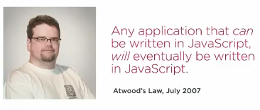
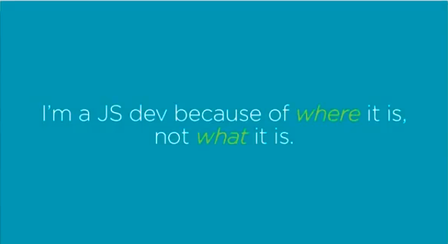
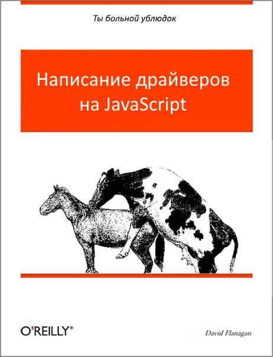
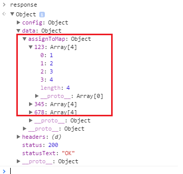

# JavaScript


## Some history


### Some history
Все, що потрібно знати про історію JavaScript: 
> JS был обязан «выглядеть как Java», только поменьше, быть эдаким младшим братом-тупицей для Java. Кроме того, он должен был быть написан за 10 дней, а иначе мы бы имели что-то похуже JS. 


### Some history
> 10 дней на то, чтобы сделать лексер, парсер, компилятор в байткод (bytecode emitter), интерпретатор, встроенные классы и декомпилятор. 


### Some history
> I'll do better in the next life. 

- Brendan Eich (создатель языка JavaScript)
- Взято із [Habrahabr](Habrahabr)


## Motivation


### Motivation
Одна із найпопулярніших мов програмування:

- TOP 1 за версією [Stack overflow](https://www.eweek.com/blogs/careers/javascript-most-popular-language-stack-overflow-report)
- TOP 1 згідно із звіту [GitHub](https://www.businessinsider.com/the-9-most-popular-programming-languages-according-to-the-facebook-for-programmers-2017-10?r=US&IR=T)


### Motivation



### Motivation
Використовується будь - де:
- Frontend - DOM - маніпуляції
- Backend - Node.js
- Desktop - Visual Studio Code, Atom.
- Mobile Development - React Native| PhoneGap


### Motivation



### Motivation



## Версіонування


### Версіонування
Спочатку трохи історії. JavaScript створювався як скриптова мова для Netscape. Після чого він був відправлений в ECMA International для стандартизації (ECMA - це асоціація, діяльність якої присвячена стандартизації інформаційних і комунікаційних технологій). Це призвело до появи нового мовного стандарту, відомого як ECMAScript. 


### Версіонування
ES - це просто скорочення для ECMAScript. Кожне видання ECMAScript отримує абревіатуру ES з подальшим його номером. Всього існує 8 версій ECMAScript. ES1 була випущена в червні 1997 року, ES2 - в червні 1998 року, ES3 - в грудні 1999 року, а версія ES4 - так і не була прийнята. ES5 був випущений в грудні 2009 року, через 10 років після виходу третього видання. 


### Версіонування
Версія ES6 / ES2015 вийшла в червні 2015 року. Це також принесло якусь плутанину в зв'язку з назвою пакета, адже ES6 і ES2015 - це одне і те ж. З виходом цього пакету оновлень комітет прийняв рішення перейти до щорічних оновлень. Тому видання було перейменовано в ES2015, щоб відображати рік релізу. Подальші версії також називаються відповідно до року їх випуску. ES2016 (ES7) вийшла в червні 2016 року.


### Версіонування
- ECMAScript 3 is fully supported in all browsers.
- ECMAScript 5 is fully supported in all modern browsers*.
- ECMAScript 6 is partially supported in all modern browsers.
- ECMAScript 7 is poorly supported in all browsers.

Взято із [](https://www.w3schools.com/js/js_versions.asp)


## JavaScript. Змінні


### JavaScript. Оголошення змінної
```js
var cout = 1;
var text = 'Hello World!';
```


### JavaScript. Типи даних
В JavaScript існує декілька основних типів даних:

- Число (number)
- Строка (string)
- Логічний (boolean)
- Спеціальне значення "null"
- Спеціальне значення "undefined"
- Об'єкти (Object)


### JavaScript. Number
```js
var num1 = 123;
var num2 = 12.345;

console.log("Type of num1 is " + typeof(num1));
console.log("Type of num2 is " + typeof(num1));
```


### JavaScript. Number
Існують спеціальні числові значення Infinity (безкінечність) і NaN (помилка обчислень). 

```js
var a = 1/0;
var b = "text" * 2;

console.log("A is " + a);
console.log("B is " + b);
```


### JavaScript. Number


### JavaScript. String
```js
var text = "Hello World!";
var text2 = 'Hello World1';

console.log(text + text2);
```

Тип символ не існує, є тільки рядок.


### JavaScript. Boolean
```js
var chacked = true;
var unchecked = false;

console.log(chacked);
console.log(unchecked);
```


### JavaScript. Null
```js
var age = null;
```

В JavaScript null не є «посиланням на неіснуючий об'єкт» або «нульовим покажчиком», як в деяких інших мовах. Це просто спеціальне значення, яке має сенс «нічого» або «значення невідомо». 


### JavaScript. Null
Значення undefined, як і null, утворює свій власний тип, що складається з одного цього значення. Воно має сенс «значення не присвоїли». 

```js
var x;

console.log(x);
```


### JavaScript. Object
```js
var client = {name: 'name1', age: 20};
console.log(a.name + ' ' a.age);
```


### JavaScript. Object
```js
var client = {
  name: "alex",
  sayHi: function(){
    console.log('Hi');
  }
}

client.sayHi();
```


### Чи дійсно в Java Script існують примітивні типи даних?
Примітиви - це значення, вони не мають властивостей. Якщо примітиви не мають властивостей, чому "abc". Length повертає значення? Код "abc". Length працює, тому що JS може легко конвертувати примітивні типи в їх відповідні об'єкти обгортки. Тому, так примітивні типи в JS існують.


## JavaScript. Масиви.


### JavaScript. Масиви
```js
var arr = [];
var numbers = [1, 2, 3];

console.log(arr[0]);
console.log(arr.length);
```


### JavaScript. Масиви
У масиві може зберігатися будь-яке число елементів будь-якого типу.

```js
var arr = [ 1, 'name', { name: 'John' }, true ];
```


### JavaScript. Масиви



### JavaScript. Масиви
Масиви в JavaScript реалізують структури даних - стек і черга.
Кінець масива:
- push() - покласти на вершину стека
- pop() - забрати з вершини стека
Початок масива:
- shift() - видаляє елемент із початку
- unshift() - додає елемент в початок масиву


### JavaScript. Масиви
```js
var stack = [];
stack.push(2);
stack.push(5);
var i = stack.pop();
console.log(i);

var queue = [];
queue.push(2);
queue.push(5);
var i = queue.shift();
console.log(i);
```


## JavaScript. Оператори розгалудження


### JavaScript. Оператори розгалудження
```js
if(умова){	
}else{
}
```

В JavaScript є два схожих оператора: == і ===. Якщо не знати їх відмінності, це може обернутися купою помилок.

Оператор == порівнює на рівність, а === - на ідентичність. Плюс оператора === полягає в тому, що він не приводить два значення до одного типу.


### JavaScript. Оператори розгалудження.
Умовний (тернарний) оператор - єдиний оператор в JavaScript, що приймає три операнди. Він часто використовується як укороченний варіант условного оператора if.

```js
умова ? вираз1 : вираз2

var elvisLives = Math.PI > 4 ? "Да" : "Нет";
console.log(elvisLives);
```


### JavaScript. Оператори розгалудження
```js
var a = 2 + 2;

switch (a) {
  case 3:
	console.log('Мало');
	break;
  case 4:
	console.log('В точку!');
	break;
  case 5:
	console.log('Багато');
	break;
  default:
	console.log('Таких значень бути не може!');
}
```


## JavaScript. Циклічні конструкції


### JavaScript. Циклічні конструкції
Цикли з передумовою:
```js
while (умова) {
	// тіло
}

for (початок; умова; крок) {
	// тіло
}
```


### JavaScript. Цмклічні конструкції
Цикли з післяумовою:
```js
do{
	вираз
}
while (умова);
```


### JavaScript. Циклічні конструкції
Обхід перечисленням:
```js
var user = {
	name: 'Alice', 
	age: 25, 
	country: 'Russia'
};

for (var prop in user) {
	console.log(prop + ": " + user[prop]);
}
```


## JavaScript. Функції


### JavaScript. Функції
б'єктами першого класу (англ. First-class object, first-class entity, first-class citizen) в контексті конкретної мови програмування називаються елементи, які можуть бути передані як параметр, повернуті з функції, присвоєні змінної.


### JavaScript. Функції
```js
function назва(параметри){
	тіло функції
}

function print(text, withEndl){
	console.log(text);
}

var ім'я = function(параметри){
	тіло функції
}

var print = function(text, withEndl){
	console.log(text);
}
```


### JavaScript. Функції
```js			
function multiply(a, b) {
	b = typeof b !== 'undefined' ? b : 1; return a*b;
	} 
	multiply(5); // 5
```


## F**k JS


### F**k JS
Глобальними називають змінні і функції, які не перебувають всередині якоїсь функції. Тобто, іншими словами, якщо змінна або функція не перебувають всередині конструкції function, то вони - «глобальні». В JavaScript все глобальні змінні і функції є властивостями спеціального об'єкта, який називається «глобальний об'єкт» (global object). 


### F**k JS
```js
window.a = 5;
alert( a );
```


### F**k JS
```js
function some(){
	a = 3;
}

function some2(){
	console.log(a);
}
```


### F**k JS
```js
							
for(var i = 0; i < 5; i++ ){
	print(i);
}

print(i); //prints 5

if(i > 4){
	var b = 77;
}

print(b); //prints 77
```


### F**k JS
- Дуже довго мову JavaScript розвивався без втрати сумісності. Нові можливості додавалися в мову, але старі - ніколи не змінювалися, щоб не «зламати» вже існуючі HTML / JS-сторінки з їх використанням.
- Однак, це призвело до того, що будь-яка помилка в дизайні мови ставала «вморожених» в нього назавжди.


### F**k JS
Так було до появи стандарту ECMAScript 5 (ES5), який одночасно додав нові можливості і вніс в мову ряд виправлень, які можуть привести до того, що старий код, який був написаний до його появи, перестане працювати.

Щоб цього не сталося, вирішили, що за замовчуванням ці небезпечні зміни будуть вимкнені, і код буде працювати по-старому. А для того, щоб перевести код в режим повної відповідності сучасним стандартом, потрібно вказати спеціальну директиву use strict.


### F**k JS
```js					
"use strict";

a = 3; //error
```


### F**k JS
Semicolon or not;
```js
function retFive(){
  return 
  5
}

console.log(retFive());
```

```js
return;
5;
```


## Функція зворотнього виклику


### Функція зворотнього виклику
В JavaScript функції - це об'єкти. Тому функції можуть приймати інші функції в якості аргументів, а також функції можуть повертати функції в якості результату. Функції, які це вміють, називаються функціями вищого порядку. А будь-яка функція, яка передається як аргумент, називається callback-функцією. Callback потрібні з однієї простої причини - JavaScript це подієво-орієнтована мова.


### Функція зворотнього виклику
```js
function first(){
	console.log(1);
} 
function second(){
console.log(2);
} 
first();
second();
```


### Функція зворотнього виклику
- Як ви і чекаєте, функція first виконається першої, а функція second після неї, і в консолі буде виведений наступний результат:

```js							
// 1 
// 2
```


### Функція зворотнього виклику
Поки що все зрозуміло. Але що якщо функція first містить якийсь код, який не може виконаєтися негайно? Наприклад, запит до API, де ми відправляємо запит і повинні чекати відповіді. Щоб змоделювати таку ситуацію, ми використовуємо функцію setTimeout


### Функція зворотнього виклику
```js
function first(){
	setTimeout( function(){ 
	console.log(1);
	}, 500 ); } 
function second(){ console.log(2); } 
first(); 
second();
```


### Функція зворотнього виклику
- Неважливо, чи розумієте ви зараз, як працює setTimout (). Основна ідея - тепер ми відклали виконання команди console.log (1) на 500 мілісекунд. І що тепер виведе наша програма?

```js						
// 2
// 1
```


### Функція зворотнього виклику
```js
function doHomework(subject) {
	console.log(`Starting my ${subject} homework.`);
 }
 doHomework('math'); // Starting my math homework.
 
 function doHomework(subject, callback) {
	console.log(`Starting my ${subject} homework.`);
	callback();
 }
 doHomework('math', function () {
	console.log('Finished my homework');
 });
 
 function doHomework(subject, callback) {
	console.log(`Starting my ${subject} homework.`);
	callback();
 } function alertFinished() {
	console.log('Finished my homework');
 }
 doHomework('math', alertFinished);
```


## JavaScript. ООП


### JavaScript. ООП


### JavaScript. ООП
```js
function Person(name, age){
	this.name = name;
	this.age = age;
	this.sayHi = function(){
		console.log("Hi my name is " + this.name);
	}
}

var person = new Person("Alex", 13);
person.sayHi();
cconsole.log(person.age);	
```


### JavaScript. ООП
```js
function Animal(name, speed){
	this.name = name;
	this.speed = speed;
}

Animal.prototype.sayHi = function(){
	console.log("Hi my name is " + name);
}

var animal = new  Animal("Jeck", 200);
console.log(animal.sayHi());
```


### JavaScript. ООП
```js
function Animal(name, speed){
	this.name = name;
	this.speed = speed;
}

Animal.prototype.sayHi = function(){
	console.log("Hi my name is " + name);
}

Animal.prototype.__proto__.sayNumber = function(){
	console.log(1);
}

var animal = new  Animal("Jeck", 200);
console.log(animal.sayHi());
console.log(animal.sayNumber());
```


### JavaScript. ООП
```js
function Animal(name, speed){
	this.name = name;
	this.speed = speed;
	this.sayHi = function(){
	  console.log("Hi im animal");
	}
  }
  
  function Rabbit(name, speed){
	Animal.call(this, name, speed);
  
	this.sayHi = function(){
	  console.log("Hi im rabbit" + this.name);
	}
  }
  
  Rabbit.prototype.__proto__ = new Animal();
  Rabbit.prototype.constructor = Rabbit;
  var rabbit = new Rabbit("Jeck", 200);
  console.log(rabbit.sayHi());
```


## Think like JavaScript


### Think like JavaScript
Дано масив, видалити всі елементи, які повторяються:

```js
var arr = [5,6,3,8,7,3,5,1];
```


### Think like JavaScript
```js
var arr = [5,6,3,8,7,3,5,1];
var obj = {};

for(var i = 0; i < arr.length; i++){
  obj[arr[i]] = null;
}

arr = [];

for(var prop in obj){
    arr.push(prop);
}

console.log(arr);
```