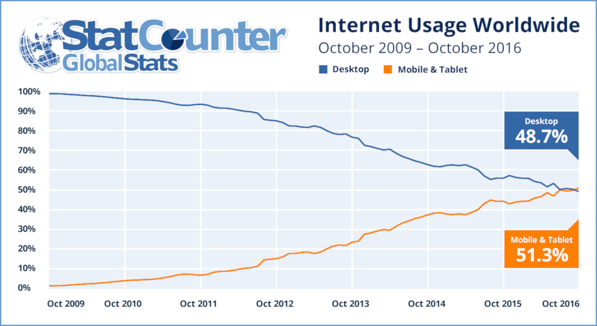
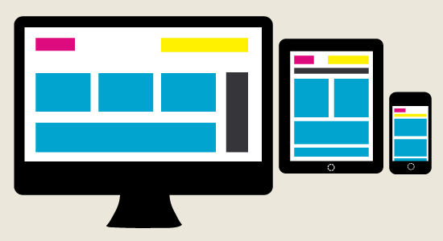
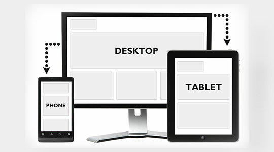

# Медіа запити


## Mobile internet traffic


### Mobile internet traffic



## When all goes wrong


### When all goes wrong
[IUS](http://ius.kdu.edu.ua/)


## Що і навіщо?


### Що і навіщо?
Медіа запити (media queries) - це правила CSS, які дозволяють управляти стилями елементів в залежності від значень технічних параметрів пристроїв. 


### Історія
 У 2001 році в HTML4 і CSS2 була введена підтримка апаратно-залежних таблиць стилів, що дозволила створювати стилі та таблиці стилів для певних типів пристроїв. В якості медіа-типів були визначені наступні: aural, braille, handheld, print, projection, screen, tty, tv.

На жаль, типи носіїв ніколи не отримували широкої підтримки в пристроях, тому вони, за винятком типу носія print, дуже рідко використовуються.


### Історія
 Медіа запити в CSS3 підхоплюють цю ідею і розвивають її. Але на додаток до визначення типу пристрою вони дозволяють отримати відомості про його можливості. Наприклад:

- ширина і висота вікна перегляду
- орієнтація


### Підтримка


## Мета - тег viewport


### Мета - тег viewport
При створенні адаптивних веб-сторінок необхідно звернути увагу на метатег viewport. Даний тег забезпечує коректне відображення дизайнів адаптивних сайтів на екранах пристроїв, що мають високу щільність пікселів. Іншими словами, він встановлює відповідність між CSS і фізичним розміром веб-сторінки. 

```html
<meta name="viewport" content="width=device-width, initial-scale=1">
```


## Синтаксис медіа запитів


### Синтаксис медіа запитів
```css
@media умова {
	/* стилі (вони будуть виконуватися, якщо пристрій відповідає зазначеному умові)
	}
```

Основні типи пристроїв:
- all - усі пристрої (за замовчуванням).
- print - принтери та режим попереднього перегляду сторінки перед друком.
- screen - пристрої з дисплеями.


## Медіа - функції


### width, min-width, max-width
- width - вказує вимоги до ширини області пристрій відобразився (браузера).
- min-width - задає мінімальну ширину області viewport в px, em або інших одиницях.
- max-width - вказує на те, якою має бути максимальна робоча область пристрої (браузера).


### width, min-width, max-width
```css
/ * Застосувати стилі CSS тільки для пристроїв з шириною області перегляду,
 рівній 320px * /
@media (width: 320px) {/ * Стилі CSS ... * /}

/ * Для пристроїв (браузерів), які надають для сторінки мінімальну ширину області перегляду, рівну 544 пікселя * /
@media (min-width: 544px) {/ * Стилі CSS ... * /}	

/ * Стилі, які будуть застосовані до елементів сторінки з робочою областю більше 1199 пікселів * /
@media (max-width: 1199px) {/ * Стилі CSS ... * /}
```


### width, min-width, max-width
height, min-height і max-height - задають вимоги аналогічно до ширини, але по відношенню до висоти viewport.

```css
/ * Стилі, які будуть застосовані до елементів сторінки в тому випадку,
 якщо viewport браузера буде більше 720px в висоту * /
@media (min-height: 720px) {/ * Стилі CSS ... * /}
```


### orientation
orientation - функція, яка перевіряє те, в якому режимі (portrait або landscape) відображається сторінка. 

```css
/ * Landscape (альбомний) - це режим, в якому навпаки ширина viewport більше її висоти * /
@media (orientation: landscape) {
   # Background-image {background: url (image1.png) no-repeat; }
}
 
/ * Portrait (портретний) - це режим, в якому висота viewport більше ширини * /
@media (orientation: portrait) {
   # Background-image {background: url (image2.png) no-repeat; }
}
```


### aspect-ration
aspect-ratio (min-aspect-ratio, max-aspect-ratio) - дозволяють вказати те, як ширина пристрою повинна ставитися до висоти. Як значення має використовуватися виключно цілі значення. 

```css
/ * Для дисплеїв зі співвідношенням сторін 16/9 * /
@media screen and (device-aspect-ratio: 16/9) {/ * Стилі CSS ... * /}
 
/ * Для дисплеїв зі співвідношенням сторін 1336/768 * /
@media screen and (device-aspect-ratio: 1336/768) {/ * Стилі CSS ... * /}
```


### resolution
resolution (min-resolution, max-resolution) - вказує дозвіл (щільність пікселів) пристрою виводу. В якості одиниць вимірювання роздільної здатності використовуються такі величини: dpi (кількість точок на дюйм), dpcm (кількість точок на сантиметр), dppx (кількість точок на піксель). 

```css
/ * Для екранів, що мають високу щільність пікселів
(Тобто для таких, у яких відношення апаратних пікселів до CSS не менше 2) * /
@media screen and (min-resolution: 2dppx) {/ * Стилі CSS ... * /}

/ * При друку з дозволом понад 300 точок на дюйм * /
@media print and (min-resolution: 300dpi) {/ * Стилі CSS ... * /}
```


## Логічні оператори


### and
and - вимагає обов'язкового виконання всіх зазначених умов. 

```css
@media screen and (min-width: 1200px) and (orientation: landscape) { /* Стили CSS ... */ }
```

Стилі CSS в вищенаведеному прикладі виконуватися тільки в тому випадку, якщо сторінка буде виводитися на пристрій з екраном, мати область перегляду більше 1200 пікселів в ширину, а також перебувати в альбомному режимі.


### , (кома)
, (кома) - вимагає обов'язкового виконання хоча б однієї із зазначених умов в медіа запиті. 

```css
@media (min-width: 544px), (orientation: landscape) { /* Стили CSS ... */ }
```

Стилі CSS в цьому прикладі будуть застосовуватися до сторінці в двох випадках. Тобто тоді, коли пристрій буде мати viewport не менше 1200 пікселів (включно) або орієнтацію landscape. 


### not
not - призначений для заперечення зазначеної умови. Має по відношенню до оператора and менший пріоритет, тобто оператор not завжди виконується після and. 

```css
@media not screen and (orientation: portrait), (min-width: 992px) { /* Стили CSS ... */ }
```


## Включення CSS з медіа запитами


### Включення CSS з медіа запитами
```css
a{
    color: red;
}

@media screen and (max-width: 200px){
    a{
        color: black;
    }
}
```

Використовуючи такий спосіб медіа - запити повинні зустрічатися в кінці css.


### Включення CSS з медіа запитами
Медіа запити можна застосовувати в якості значення атрибута media елемента link. Це дозволить в залежності від параметрів пристрою визначити, які файли CSS необхідно під'єднати до сторінці, а які ні. 

```html
<! - Стилі xs-styles.css будуть приєднані до сторінки тільки на пристроях c шириною менше 543 пікселів (включно) ->
<link rel="stylesheet" media="screen and (max-width: 543px)" href="styles-xs.css">
```


### Включення CSS з медіа запитами
Крім цього медіа запити можна також використовувати в правилі @import, яке призначене для імпортування стилів з інших файлів CSS в поточний. 

```css
/ * Імпортування стилів з файлу styles-xs.css в поточний файл стилів тільки для пристроїв, які надають веб-сторінці viewport, що має ширину 543 пікселів або менше. * /
@import url (styles-xs.css) (max-width: 543px);
```


## Що собою являє адаптивна сторінка?


### Що собою являє адаптивна сторінка?


### Що собою являє адаптивна сторінка?



### Що собою являє адаптивна сторінка?



## Moblie first


### Mobile first
Історично склалося так, що веб-дизайнери починають розробку дизайну сайту для великого екрану, тобто перший і «головний» дизайн робиться для робочого столу комп'ютера, так як передбачає більшу функціональність.

Недоліком такого підходу є те, що по суті пріоритет віддається користувачам комп'ютерів і ноутбуків.


### Mobile first
Філософія дизайну Mobile first перевертає колишні уявлення з ніг на голову. Хоча багато розробників як і раніше починають проектування не з мобільних пристроїв, але тепер вони враховують можливості та обмеження їх екранів, створюючи дизайн сайту.


### Mobile first
**Mobile First** - один з головних трендів в світі SEO. Це нова модель індексації, при якій Google при ранжируванні сайтів, враховує саме мобільну версію сайту.


### Mobile first
Тому одні з найважливіших вимог в Mobile First розробці це:
- адаптивний дизайн
- Показати найважливіше зміст в першу чергу
- Вебсайт повинен бути легковажним і оптимізованим


## Best Practices


### Best Practices
Не використовуйте популярні розміри пристроїв (320px = портрет iPhone, 480px = пейзаж iPhone, портрет 768px iPad тощо), щоб визначити точки зупину. Ландшафт пристрою постійно змінюється, тому сьогоднішні цінності можуть бути незрозумілими навіть через рік.

