# Позиціонування блоків


## Розміри блоку


### Розміри блоку
Властивості width та heigth використовуються для встановлення висоти та ширини елемента.

Висоту і ширину можна встановити на auto (це за замовчуванням. Значить, що браузер обчислює висоту і ширину) або вказується у значеннях довжини, наприклад px, cm тощо, або у відсотках (%) блоку, що містить.


### Розміри блоку
```css
div{
    width: 100px;
    height: 100px;
}
```


## Відступи


### Відступи


### margin
Властивість margin задає зовнішні відступи елемента - відступи від зовнішньої межі елементу до кордонів батьківського елемента або до сусідніх елементів.


### margin
Способи запису властивості margin аналогічні властивості padding.

```css
margin: 10px;
margin: 5px 10px;
margin: 5px 10px 15px;
margin: 5px 10px 15px 20px;
```


### margin
1. Однакові відступи з усіх сторін.
2. Зверху і знизу 5px, праворуч і ліворуч 10px.
3. Зверху 5px, зліва і справа 10px, знизу 15px.
4. Верхній, правий, нижній, лівий відступи відповідно.

Можна задавати відступи для різних сторін за допомогою властивостей margin-left, margin-right, margin-top, margin-bottom.


### padding
Властивість padding задає внутрішні відступи елемента - відступи від зовнішньої межі елементу до його змісту. Ці відступи ще іноді називають полями.


### padding
Існує кілька способів запису властивості padding.

```css
padding: 10px;
padding: 5px 10px;
padding: 5px 10px 15px;
padding: 5px 10px 15px 20px;
```


### padding
1. Однакові відступи з усіх сторін.
2. Відступи зверху і знизу 5px, праворуч і ліворуч 10px.
3. Відступ зверху 5px, зліва і справа 10px, знизу 15px.
4. Різні відступи з усіх сторін, в порядку верхній, правий, нижній, лівий.

Також можна задавати відступи для різних сторін за допомогою властивостей padding-left, padding-right, padding-top, padding-bottom.


## border


### border
Властивість border CSS дозволяють вказати стиль, ширину і колір межі елемента.

```css
p {
    border: [style] [width] [color];
}
```


### border
В якості стилю межі дозволені такі значення:
- dotted
- dashed
- solid
- double
- groove
- ridge
- inset
- outset
- none
- hidden


### border


### border
```html
<p>
  Lorem ipsum dolor sit amet, consectetur adipisicing elit. Ipsa repellat facere voluptatum dolorem explicabo nostrum porro! Ex, aperiam dolorem exercitationem voluptate aliquam, in beatae, odio tempora provident dolores iusto dicta.
</p>
```

```css
p {
  border: solid 2px green;
}
```


### border


## border-radius


### border-radius
Закруглення кутів в CSS можна зробити для будь-якого елементу HTML-сторінки. Для цього необхідно застосувати до нього властивість border-radius з відповідним значенням. Найчастіше значення вказується в пікселях, але можна також використовувати і інші одиниці, наприклад, em або відсотки (в останньому випадку обчислення проводиться щодо ширини блоку).


### border-radius
```html
<div class="parent">
  <div class="child">
    
  </div>
</div>
```

```css
.child{
  width: 80%;
  margin: 0 auto;
  min-height: 100px;
  border: 6px solid #7922CC;
  border-radius: 25px;
}
```


### border-radius
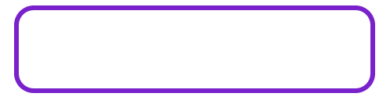


### border-radius
Значення зкруглення для кожного кута може бути різним:

```css
.child{
  width: 80%;
  margin: 0 auto;
  min-height: 100px;
  border: 6px solid #7922CC;
  border-radius: 25px 100px 25px 100px;
}
```


### border-radius
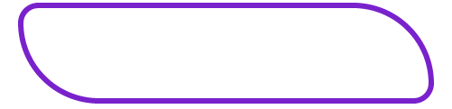


## box-shadow


### box-shadow
box-shadow додає тінь до елементу. Допускається використовувати кілька тіней, вказуючи їх параметри через кому, при накладенні тіней перша тінь в списку буде вище, остання нижче. Якщо для елемента задається радіус округлення через властивість border-radius, то тінь також вийде з закругленими кутами. Додавання тіні збільшує ширину елемента, тому можлива поява горизонтальної смуги прокрутки в браузері.


### box-shadow
Даний стиль записується в такий спосіб:

```css
box-shadow: inset 4px 4px 8px 5px # 333333;
```


### box-shadow
Розглянемо по порядку, за що відповідає кожен параметр (зліва направо):

- Ключове слово inset: параметр, який необов'язково вказувати; малює тінь усередині елемента.
- Зрушення по осі X: вказує ступінь зміщення тіні по горизонталі щодо елемента. Позитивне значення означає зсув вправо, негативне - вліво. Значення 0 означає, що тінь без зсуву.
- Зрушення по осі Y: вказує ступінь зміщення тіні по вертикалі. Позитивне значення означає зсув вниз, негативне - вгору. Значення 0 - це тінь без зсуву.


### box-shadow
- Радіус розмиття: це ступінь розмиття тіні. Чим більше значення, тим більш розмита тінь. Якщо параметр не вказано, використовується значення за замовчуванням - 0. В такому випадку тінь буде ідеально чіткої.
- Розширення: необов'язковий параметр, що відповідає за розтягнення тіні по обох осях; чим більше значення, тим більше розтягнення. Розширення працює тільки при наявності попереднього параметра. Значення за замовчуванням - 0.
- Колір тіні: з цим параметром все зрозуміло - він задає колір тіні елемента. Колір за умовчанням чорний.


### box-shadow
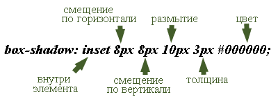


### box-shadow
```css
box-shadow: 0 2px 4px rgba(0, 0, 0, .25);
```

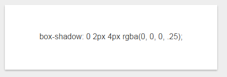


### box-shadow
```css
box-shadow: 0 1px 4px rgba(0, 0, 0, .3),
            -23px 0 20px -23px rgba(0, 0, 0, .6),
            23px 0 20px -23px rgba(0, 0, 0, .6),
            inset 0 0 40px rgba(0, 0, 0, .1);
```

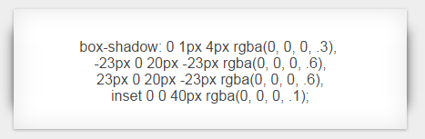


## Фоновий колір і фонове зоображення


### background-color
Визначає колір фону елемента. Хоча це властивість не буде наслідувати властивості свого батька, через те, що початкове значення встановлюється прозорим, колір фону дочірніх елементів збігається з кольором фону батьківського елементу.

```css
background-color: <колір> | transparent | inherit
```


### background-color
```html
<main>
  <div id="inner">
    dfg
  </div>
  <div id="inner2">
    dfg
  </div>
   <div id="inner3">
    dfg
  </div>
</main>
```

```css
main{
  background-color: orange;
  height: 100vh;
}

#inner{
  background-color: red;
}

#inner2{
  background-color: red transparent;
}
#inner3{
  background-color: rgba(255,255,255,.5);
}
```


### background-color
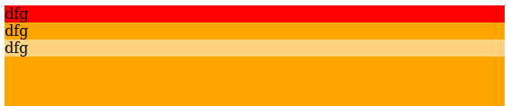


### background-image
Встановлює фонове зображення для елемента. Якщо одночасно для елемента задано колір фону, він буде показаний, поки фонова картинка не завантажиться повністю. Те ж відбудеться, якщо зображення не доступні або їх показ в браузері відключений. У разі наявності в малюнку прозорих областей, через них буде проглядатися фоновий колір. В CSS3 допустимо вказувати кілька фонових зображень, перераховуючи їх параметри через кому.


### background-image
```css
background-image: url(путь к файлу) | none | inherit
```


### background-image
```html
&lt;!DOCTYPE html&gt;
&lt;html&gt;
 &lt;head&gt;
  &lt;meta charset=&quot;utf-8&quot;&gt;
  &lt;title&gt;background-image&lt;/title&gt;
  &lt;style&gt;
   body {
    background-image: url(images/bg.jpg); /* Путь к фоновому изображению */
    background-color: #c7b39b; /* Цвет фона */
   }
  &lt;/style&gt;
   &lt;/head&gt;
 &lt;body&gt;
  &lt;p&gt;...&lt;/p&gt;
 &lt;/body&gt;
&lt;/html&gt;
```


### background-image
Якщо фон задається для рядка таблиці (тег &lt;tr&gt;), то Chrome, Safari, iOS відображають його не так, як наказує специфікація, а саме для кожного осередку окремо. У той час як браузер повинен показувати цілісний фон для всього ряду.

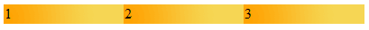
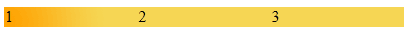


### background
Універсальна властивість background дозволяє встановити одночасно до п'яти характеристик фону. Значення можуть йти в будь-якому порядку, браузер сам визначить, яке з них відповідає потрібному властивості.

```css
background: [background-attachment || background-color || background-image 
  || background-position || background-repeat] | inherit
```


### background
```html
<div>
   Duis te feugifacilisi. Duis autem dolor in hendrerit in vulputate velit esse molestie 
   consequat, vel illum dolore eu feugiat nulla facilisis at vero eros et accumsan et 
   iusto odio dignissim qui blandit praesent luptatum zzril delenit au gue duis dolore
   te feugat nulla facilisi. Ut wisi enim ad minim veniam, quis nostrud exerci taion 
   ullamcorper suscipit lobortis nisl ut aliquip ex en commodo consequat. Duis te 
   feugifacilisi per suscipit lobortis nisl ut aliquip ex en commodo consequat.
  </div>
```

```css
height: 200px; / * Висота блоку * /
     width: 200px; / * Ширина блоку * /
     overflow: auto; / * Додаємо смуги прокрутки * /
     padding-left: 15px; / * Відступ від тексту зліва * /
     background: url (images / hand.png) repeat-y # fc0; /* Колір фону,
                                                     шлях до фонового зображення і
                                                     повторення фону по вертикалі * /
```


### background
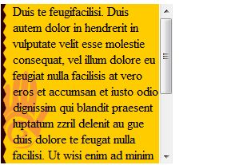


## overflow


### overflow
Властивість **overflow** управляє відображенням змісту блокового елемента, якщо воно цілком не поміщається і виходить за область заданих розмірів.


### overflow
```css
overflow: auto | hidden | scroll | visible | inherit
```


### overflow
Можливі значення:
- visible - Відображається весь зміст елемента, навіть за межами встановленої висоти і ширини.
- hidden - Відображається лише область всередині елемента, інше буде приховано.
- scroll - Завжди додаються смуги прокрутки.
- auto - Смуги прокрутки додаються тільки при необхідності.
- inherit - Успадковує значення батька.


### overflow
```html
&lt;!DOCTYPE html&gt;
&lt;html&gt;
 &lt;head&gt;
  &lt;meta charset=&quot;utf-8&quot;&gt;
  &lt;title&gt;overflow&lt;/title&gt;
  &lt;style&gt;
   .layer {
    overflow: scroll; / * Додаємо смуги прокрутки * /
    width: 300px; / * Ширина блоку * /
    height: 150px; / * Висота блоку * /
    padding: 5px; / * Поля навколо тексту * /
    border: solid 1px black; / * Параметри рамки * /
   } 
  &lt;/style&gt;
 &lt;/head&gt;
 &lt;body&gt; 
   &lt;div class=&quot;layer&quot;&gt;
   &lt;h2&gt;Duis te feugifacilisi&lt;/h2&gt;
   &lt;p&gt;Lorem ipsum dolor sit amet, consectetuer adipiscing elit, sed diem 
    nonummy nibh euismod tincidunt ut lacreet dolore magna aliguam erat volutpat. 
    Ut wisis enim ad minim veniam, quis nostrud exerci tution ullamcorper suscipit 
    lobortis nisl ut aliquip ex ea commodo consequat.&lt;/p&gt;
  &lt;/div&gt; 
 &lt;/body&gt;
&lt;/html&gt;
```


### overflow
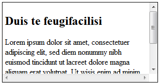


## inline - blocks


### inline - blocks
Іноді виникає необхідність розташувати в ряд кілька елементів із заданими розмірами. Рядкові елементи для цього не підходять, так як не сприймають розміри. Блокові елементи теж не підходять, так як до і після них існує перенесення рядка.

Простий спосіб - використовувати блочно-рядкові елементи. В HTML немає тегів, які за умовчанням вели б себе як блочно-рядкові, але будь-який елемент можна перемкнути в даний режим, задавши йому властивість display із значенням inline-block.


### inline - blocks
Особливості блочно-строкових елементів:

- їм можна задавати розміри, рамки і відступи, як і блоковим елементам;
- їх ширина за замовчуванням залежить від змісту, а не розтягується на всю ширину контейнера;
- вони не породжують примусових переносів рядків, тому можуть розташовуватися на одному рядку, поки поміщаються в батьківський контейнер;
- елементи в одному рядку вирівнюються вертикально подібно строковим елементам.


### inline - blocks
```html
<header>
  <nav>
    <ul>
      <li><a href="">Link 1</a></li>
      <li><a href="">Link 2</a></li>
      <li><a href="">Link 3</a></li>
      <li><a href="">Link 4</a></li>
      <li><a href="">Link 5</a></li>
    </ul>
  </nav>
</header>
```


### inline - blocks


### inline - blocks
```css
*{
  margin: 0;
  padding: 0;
}

nav{
  background-color: orange;
}

ul li {
  display: inline;
  padding: 5px;
}
```


### inline - blocks


### inline - blocks
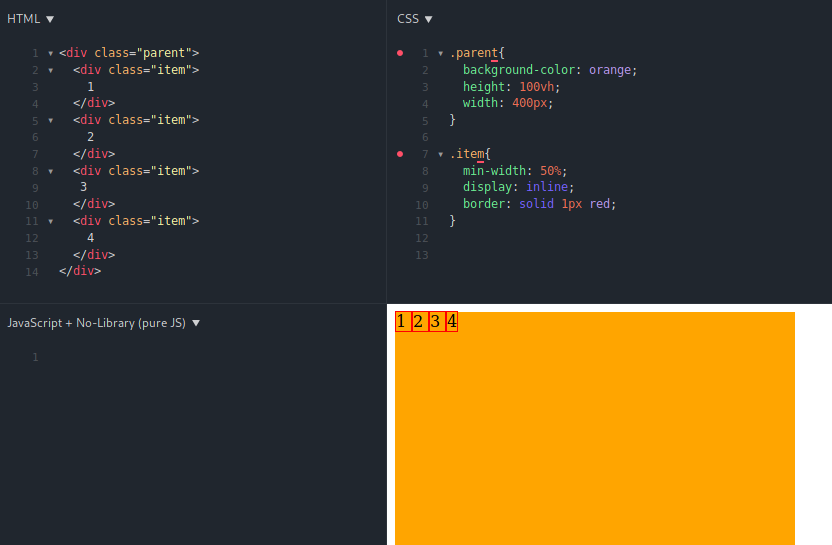


### inline - blocks
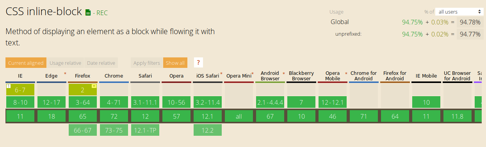


## Плаваючі елементи


### Плаваючі елементи
**Плаваючими** будемо називати такі елементи, які обтікають по контуру іншими об'єктами веб-сторінки, так і з текстом. Слід розуміти, що ніхто і ніде не плаває, тому правильніше говорити «обтічні елементи», але з іншого боку термін «плаваючий елемент» давно вже прижився, так що його і будемо використовувати надалі.


### Плаваючі елементи
**Плаваючі** елементи досить активно застосовуються при верстці і в основному служать для втілення таких завдань.

- Обтікання картинок текстом.
- Розташування шарів по горизонталі (додавання колонок).


### Плаваючі елементи
Все це виконує одна стильова властивість float, а допомагають йому в цьому інші властивості. Хоча спочатку float не планувався на настільки універсальну роль, але життєві реалії розставили все по своїх місцях.


### Плаваючі елементи
Нехай є задача розмістити 4 div`a в колонку.

```html
<section>
  <div class="item div1">
    Lorem ipsum dolor sit amet, consectetur adipisicing elit. Sed, dignissimos ex eligendi dolorem fuga officia magnam, vitae optio. Cupiditate debitis tempore, accusamus, necessitatibus eos dolor nam quae earum magni. Beatae.
  </div>
  <div class="item div2">
    Lorem ipsum dolor sit amet, consectetur adipisicing elit. Sed, dignissimos ex eligendi dolorem fuga officia magnam, vitae optio. Cupiditate debitis tempore, accusamus, necessitatibus eos dolor nam quae earum magni. Beatae.
  </div>
  <div class="item div3">
    Lorem ipsum dolor sit amet, consectetur adipisicing elit. Sed, dignissimos ex eligendi dolorem fuga officia magnam, vitae optio. Cupiditate debitis tempore, accusamus, necessitatibus eos dolor nam quae earum magni. Beatae.
  </div>
  <div class="item div4">
    Lorem ipsum dolor sit amet, consectetur adipisicing elit. Sed, dignissimos ex eligendi dolorem fuga officia magnam, vitae optio. Cupiditate debitis tempore, accusamus, necessitatibus eos dolor nam quae earum magni. Beatae.
  </div>
</section>
```


### Плаваючі елементи
```css
section{
  background-color: orange;
}

.item{
  float: left;
  width: 25%;
}
```


### Плаваючі елементи
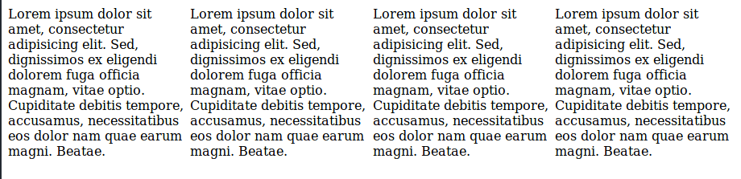


### Плаваючі елементи
Всі елементи із класом item знаходяться всередині тега section і не мають властивості background, що означає, що вони повинні відображатися на фоні батькіського елемента. На практиці все складніше, елемент, який містить в собі плаваючі елементи згортається до нульової висоти:


### Плаваючі елементи
```css
section{
  background-color: orange;
  height: 100vh;
}

.item{
  float: left;
  width: 25%;
}
```


### Плаваючі елементи
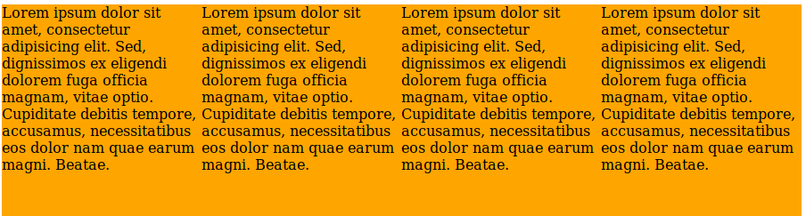


### clearfix
Для того, щоб батьківський елемент мав висоту найбільшого плаваючого блоку потрібно використати властивість overflow:

```html
<section class="clearfix">
  <div class="item div1">
    Lorem ipsum dolor sit amet, consectetur adipisicing elit. Sed, dignissimos ex eligendi dolorem fuga officia magnam, vitae optio. Cupiditate debitis tempore, accusamus, necessitatibus eos dolor nam quae earum magni. Beatae.
  </div>
  <div class="item div2">
    Lorem ipsum dolor sit amet, consectetur adipisicing elit. Sed, dignissimos ex eligendi dolorem fuga officia magnam, vitae optio. Cupiditate debitis tempore, accusamus, necessitatibus eos dolor nam quae earum magni. Beatae.
  </div>
  <div class="item div3">
    Lorem ipsum dolor sit amet, consectetur adipisicing elit. Sed, dignissimos ex eligendi dolorem fuga officia magnam, vitae optio. Cupiditate debitis tempore, accusamus, necessitatibus eos dolor nam quae earum magni. Beatae.
  </div>
  <div class="item div4">
    Lorem ipsum dolor sit amet, consectetur adipisicing elit. Sed, dignissimos ex eligendi dolorem fuga officia magnam, vitae optio. Cupiditate debitis tempore, accusamus, necessitatibus eos dolor nam quae earum magni. Beatae.
  </div>
  </div>
</section>
```


### clearfix
```css
section{
  background-color: orange;
}

.item{
  float: left;
  width: 25%;
}

.clearfix {
  overflow: auto;
}
```


### clearfix
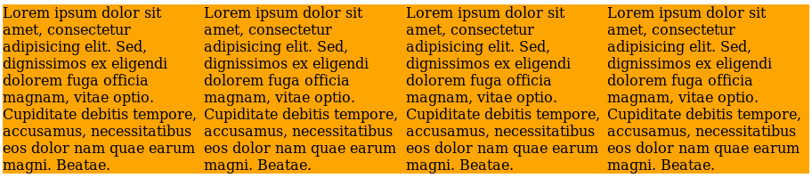


### Плаваючі елементи
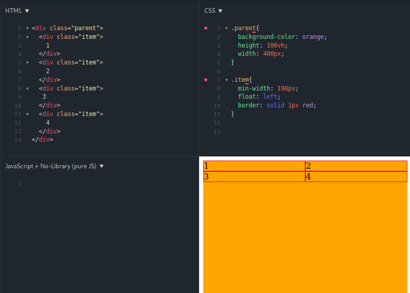


### Плаваючі елементи


## Фіксоване і абсолютне позиціонування


### Фіксоване і абсолютне позиціонування
Властивість **position** визначає тип методу позиціонування, який використовується для елемента.

Є п'ять різних значень **position**:

- static
- relative
- fixed
- absolute
- sticky


### static
- Елементи HTML позиціонуються статичними за замовчуванням.
- На елементи статичного розташування не впливають top, bottom, left і right властивості.
- Елемент з положенням: статичний; не розташований спеціально; він завжди розташований відповідно до звичайного потоку сторінки.


### relative
Елемент з **position: relative;** позиціонується відносно свого нормального положення.

Налаштування top, right, bottom і left властивостей відносно розташованого елемента призведе до відхилення його від нормального положення. Інший вміст не буде коригуватися, щоб вписатися в будь-який пробіл, що залишився елементом.


### relative
```html
<section>
  <div>
    Lorem ipsum dolor sit amet, consectetur adipisicing elit. Aspernatur, fuga reiciendis similique dolore consequuntur laudantium ipsa dicta praesentium consectetur, quaerat tempore, at magnam eaque vero quos optio aut velit minus?
  </div>
</section>
```

```css
section{
  background-color: orange;
  height: 100vh;
}

section > div{
  position: relative;
  top: 50px;
  left: 20px;
}
```


### relative
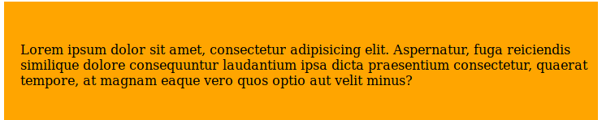


### fixed
Елемент з **position: fixed;**; позиціонується відносно вікна перегляду, що означає, що він завжди залишається на тому ж місці, навіть якщо сторінка прокручується. Властивості верхнього, правого, нижнього і лівого використовуються для позиціонування елемента.


### fixed
```html
&lt;!DOCTYPE html&gt;
&lt;html&gt;
&lt;head&gt;
&lt;style&gt;
div.fixed {
  position: fixed;
  bottom: 0;
  right: 0;
  width: 300px;
  border: 3px solid #73AD21;
}
&lt;/style&gt;
&lt;/head&gt;
&lt;body&gt;

&lt;h2&gt;position: fixed;&lt;/h2&gt;

&lt;p&gt;An element with position: fixed; is positioned relative to the viewport, which means it always stays in the same place even if the page is scrolled:&lt;/p&gt;

&lt;div class=&quot;fixed&quot;&gt;
This div element has position: fixed;
&lt;/div&gt;

&lt;/body&gt;
&lt;/html&gt;
```


### fixed
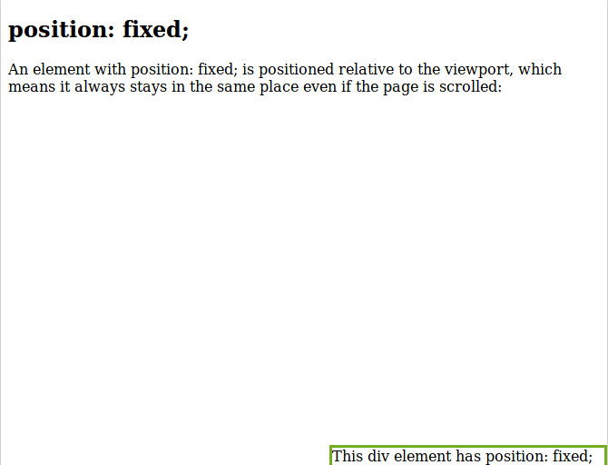


### absolute
Елемент з **position: absolute**; розташовується відносно найближчого предка (замість розташування відносно вікна перегляду, як фіксований).

Однак; якщо абсолютний позиційний елемент не має позиціонованих предків, він використовує тіло документа і рухається разом з прокруткою сторінок.

**Примітка**: "позиціонований" елемент - це той, чия позиція є чимось, крім static.


### absolute
```css
div.relative {
  position: relative;
  width: 400px;
  height: 200px;
  border: 3px solid #73AD21;
}

div.absolute {
  position: absolute;
  top: 80px;
  right: 0;
  width: 200px;
  height: 100px;
  border: 3px solid #73AD21;
}
```


### absolute
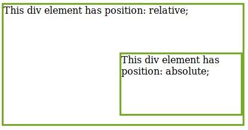


### sticky
Елемент з **position: sticky;** позиціонується на основі положення прокрутки користувача.

Липкий елемент перемикається між відносним і фіксованим, залежно від положення прокрутки. Він позиціонується відносно, поки задана позиція зміщення не зустрінеться у вікні перегляду - тоді вона "прилипає" на місце (подібне положення: фіксований).


### sticky
[Try It](https://www.w3schools.com/css/tryit.asp?filename=trycss_position_sticky)


## Накладання елементів


### Накладання елементів
Якщо в одному місці сторінки виявляються кілька «абсолютних» блоків, то вони перекривають один одного. За замовчуванням вище виявляється той блок, який розташований далі в коді сторінки.

C допомогою CSS-властивості z-index можна управляти тим, як перекриваються блоки. Значення цього властивості може бути ціле число. Чим більше z-index, тим вище розташовується блок.

Властивості z-index працює для елементів, у яких position задано як absolute, fixed і relative. Таким чином, «відносний» елемент може перекривати «абсолютний».


### Накладання елементів
```html
&lt;!DOCTYPE html&gt;
&lt;html lang=&quot;ru&quot;&gt;
  &lt;head&gt;
    &lt;meta charset=&quot;utf-8&quot;&gt;
    &lt;link rel=&quot;stylesheet&quot; href=&quot;style.css&quot;&gt;
  &lt;/head&gt;
  &lt;body&gt;
    &lt;div class=&quot;block block-1&quot;&gt;Блок 1&lt;/div&gt;
    &lt;div class=&quot;block block-2&quot;&gt;Блок 2&lt;/div&gt;
    &lt;div class=&quot;block block-3&quot;&gt;Блок 3&lt;/div&gt;
  &lt;/body&gt;
&lt;/html&gt;
```

```css
body {
  margin: 0;
  padding: 20px;
}

.block {
  padding: 10px;
  text-align: right;
  color: white;
  opacity: 0.8;
}

.block-1 {
  width: 350px;
  height: 350px;
  background-color: #3a78a1;
  position: relative;
  z-index: 200;
}

.block-2 {
  position: absolute;
  top: 20px;
  width: 250px;
  height: 250px;
  background-color: #e74c3c;
  z-index: 100;
}

.block-3 {
  position: absolute;
  top: 20px;
  width: 150px;
  height: 150px;
  background-color: #27ae60;
}
```


### Накладання елементів
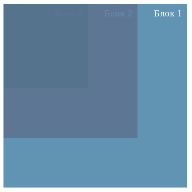

