# Псевдоселектори, анімація


## Псевдоселектори
В CSS в якості селекторів можуть застосовуватися **псевдо-класи** і **псевдо-елементи**.


## Псевдо - класи


### Псевдо - класи
**Псевдо-класи** призначені для зміни стилю існуючих елементів сторінки в залежності від їх динамічного стану, наприклад при роботі з посиланнями (: link,: visited,: hover,: active,: focus).


### Псевдо - класи
**В CSS2 визначені ще 2 псевдо-класу**:
- :first-child - перший дочірній елемент.
- :lang (language) - мову фрагмента документа.


### Псевдо - класи
**Решта псевдо-класи відносяться до CSS3. Приклади деяких з них**:
- :last-child - останній дочірній елемент.
- :first-of-type - перший дочірній елемент заданого типу.
- :last-of-type - останній дочірній елемент заданого типу.
- :nth-child (n) - n-дочірній елемент.
- :nth-last-child (n) - n-дочірній елемент, відлік ведеться з кінця.
- :nth-of-type (n) - n-дочірній елемент заданого типу.
- :nth-last-of-type (n) - n-дочірній елемент заданого типу, відлік ведеться з кінця.
- :not (selector) - стилізація елементів, які не містять заданий селектор.


### Псевдо - класи
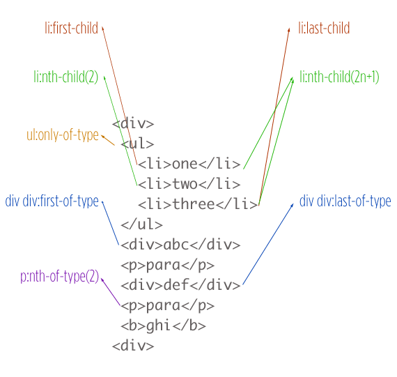


### Стилізація посилання, при наведенні на нього
```html
&lt;header&gt;
  &lt;nav&gt;
    &lt;ul&gt;
      &lt;li&gt;&lt;a href=&quot;&quot;&gt;Home&lt;/a&gt;&lt;/li&gt;
      &lt;li&gt;&lt;a href=&quot;&quot;&gt;Home&lt;/a&gt;&lt;/li&gt;
      &lt;li&gt;&lt;a href=&quot;&quot;&gt;Home&lt;/a&gt;&lt;/li&gt;
    &lt;/ul&gt;
  &lt;/nav&gt;
&lt;/header&gt;
```


### Стилізація посилання, при наведенні на нього
```css
* {
  margin: 0;
  padding: 0;
}

header {
  background-color: black;
  height: 60px;
  border-bottom: solid 1px gray;
  line-height: 60px;
}

ul > li {
  display: inline;
  padding: 5px;
}

ul > li > a {
  color: white;
  text-decoration: none;
}

ul > li > a:hover{
  color: gray;
}
```


### Стилізація посилання, при наведенні на нього
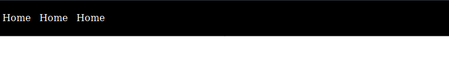


### Стилізація посилання, при наведенні на нього
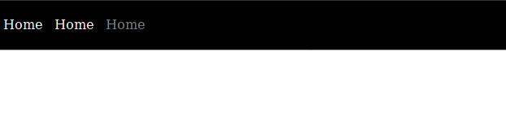


### Стилізація посилання, при наведенні на нього
[JsFiddle](https://jsfiddle.net/1bmh4p60/22/)


### Стилізація вимкненого input - елемента
```html
&lt;div&gt;
  &lt;form action=&quot;&quot;&gt;
    &lt;input type=&quot;text&quot; disabled id=&quot;input&quot;&gt;
  &lt;/form&gt;
&lt;/div&gt;
```


### Стилізація вимкненого input - елемента
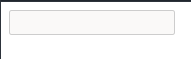


### Стилізація вимкненого input - елемента
Для того, щоб застосувати сить потрібно скористатися псевдо-класом **:disabled**:
**css**:
```css
#input:disabled {
  border: solid 1px red;
}
```


### Стилізація вимкненого input - елемента
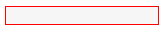


## Псевдо - елементи


### Псевдо - елементи
**Псевдо-елементи** визначають стиль елементів, чітко не визначений в структурі документа (: first-letter,: first-line), а також дозволяють генерувати і стилізувати неіснуючий вміст (: before,: after і властивість content). В CSS3 псевдо-елементи починаються з двох двокрапок :: (:: first-letter, :: first-line, :: before, :: after).

В CSS3 також був (до 2008 року) псевдо-елемент :: selection. Він стилізує виділений користувачем текст. Браузери Mozilla Firefox і SeaMonkey підтримують нестандартний псевдо-елемент :: - moz-selection.


### Додавання маркера до списку
```html
&lt;!DOCTYPE html&gt;
&lt;html&gt;
 &lt;head&gt;
  &lt;meta charset=&quot;utf-8&quot;&gt;
  &lt;title&gt;before&lt;/title&gt;
  &lt;style&gt;
   li::before {
     content: &quot;&para;&quot;; /* Додаємо бажаний символ перед елементом списку */
   }
   li {
     list-style: none; /* Прибираємо вихідні маркери */
   }
  &lt;/style&gt;
 &lt;/head&gt;
 &lt;body&gt;
   &lt;ul&gt;
     &lt;li&gt;Альфа&lt;/li&gt;
     &lt;li&gt;Бета&lt;/li&gt;
     &lt;li&gt;Гамма&lt;/li&gt;
   &lt;/ul&gt;
 &lt;/body&gt;
&lt;/html&gt;
```


### Додавання маркера до списку
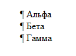


### Додавання кавичок у відгуках
```html
&lt;section id=&quot;review&quot;&gt;
&lt;h2&gt;Reviews&lt;/h2&gt;
  &lt;div id=&quot;review-inner&quot;&gt;
    Lorem ipsum dolor sit amet, consectetur adipisicing elit. Ratione totam aperiam beatae aut earum doloremque! Odit neque accusantium odio obcaecati illum, voluptatum, nisi et! Porro architecto tempore deserunt, officia quasi.
  &lt;/div&gt;
&lt;/section&gt;
```


### Додавання кавичок у відгуках
```css
body{
  margin: 0;
  padding: 0;
}

#review {
    background-color: #4286f4;
    color: white;
    margin: 0;
    padding: 5px;
}

h2 {
  text-align: center;
}

#review-inner::before {
  content: '\0022';
  display: inline;
  font-size: 40px;
}
```


### Додавання кавичок у відгуках
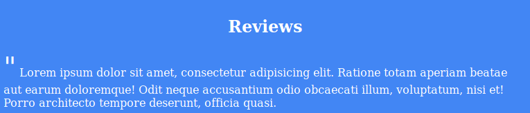


### clearfix, використовуючи псевдо - елемент
Псевдоелементи дозволяють за допомогою CSS вставити в структуру HTML-документа вузли, яких немає в HTML коді. Тобто можна вставити в код елемент і не писати його в HTML. Завдяки псевдоелементи з'явилося рішення проблеми флоат без використання додаткового елемента.


### clearfix, використовуючи псевдо - елемент
Є кілька його варіацій, але ось одна з поширених. В CSS додається наступне правило:
```css
.clearfix::after {
  content: "";
  display: table;
  clear: both;
}
```

А потім клас clearfix додається до контейнера, всередині якого лежать флоатние колонки. Після цього в контейнер не потрібно додавати додатковий елемент-розпірку, так як розпірка створюється за допомогою псевдоелемента.


### clearfix, використовуючи псевдо - елемент
```html
&lt;section class=&quot;clearfix&quot;&gt;
  &lt;div class=&quot;item&quot;&gt;
    Lorem ipsum dolor sit amet, consectetur adipisicing elit. Error illum, dolore velit provident non fugit. Repellat perferendis rerum officia commodi voluptas quia earum aut dolorem labore cumque, culpa ab cum!
  &lt;/div&gt;
  &lt;div class=&quot;item&quot;&gt;
    Lorem ipsum dolor sit amet, consectetur adipisicing elit. In odit reiciendis necessitatibus molestias minus quia quisquam provident, laudantium aut, eligendi, quo obcaecati porro consectetur voluptatum consequatur voluptate iusto! Quos, eius?
  &lt;/div&gt;
&lt;/section&gt;
```


### clearfix, використовуючи псевдо - елемент
```css
section {
  background-color: orange;
}

section div {
  width: 50%;
  float: left;
}

.clearfix::after {
  content: "";
  display: table;
  clear: both;
}
```


### clearfix, використовуючи псевдо - елемент
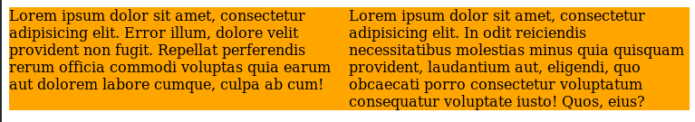


## CSS - трансформації


### CSS - трансформації
Модель візуального форматування CSS описує систему координат всередині кожного позиціонованого елемента. Система координат є точкою відліку для властивостей зміщення. Положення і розміри в цьому координатному просторі можна розглядати як задані в пікселях, щодо точки відліку, з позитивними значеннями, що йдуть вправо і вниз. Це координатне простір можна змінити за допомогою властивості **transform**.


### transform
Трансформує елемент, зокрема, дозволяє його масштабувати, обертати, зрушувати, нахиляти, а також комбінувати види трансформацій.

```css
transform: <функція> [<функція>]* | none
```


### none
Значення за замовчуванням, означає відсутність трансформації. Також скасовує трансформацію для елемента з групи трансформованих елементів.


### matrix
```css
matrix(a, c, b, d, x, y)
```


### matrix
- Зміщує елементи і задає спосіб їх трансформації, дозволяючи об'єднати кілька функцій 2D-трансформацій в одній. Як трансформації допустимі поворот, масштабування, нахил і зміна положення.
- Значення a змінює масштаб по горизонталі. Значення від 0 до 1 зменшує елемент, більше 1 - збільшує.
- Значення c деформує (зрушує) сторони елемента по осі Y, позитивне значення - вгору, негативне - вниз.
- Значення b деформує (зрушує) сторони елемента по осі X, позитивне значення - вліво, негативне - вправо.
- Значення d змінює масштаб по вертикалі. Значення менше 1 зменшує елемент, більше 1 - збільшує.


### matrix
- Значення x зміщує елемент по осі X, позитивне - вправо, негативне - вліво.
- Значення y зміщує елемент по осі Y, позитивне значення - вниз, негативне - вгору.


### matrix
```html
<div>Normal</div>
<div class="changed">Changed</div>
```

```css
div {
  width: 80px;
  height: 80px;
  background-color: skyblue;
}

.changed {
  transform: matrix(1, 2, -1, 1, 80, 80);
  background-color: pink;
}
```


### matrix
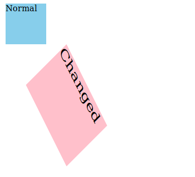


### translate
Зрушує елемент на нове місце, переміщаючи щодо звичайного положення вправо і вниз, використовуючи координати X і Y, не зачіпаючи при цьому сусідні елементи. Якщо потрібно зрушити елемент вліво або вгору, то потрібно використовувати негативні значення.

```css
translate(tx, ty)
```


### translate
```html
<div>Static</div>
<div class="moved">Moved</div>
<div>Static</div>
```


### translate
```css
div {
  width: 60px;
  height: 60px;
  background-color: skyblue;
}

.moved {
  transform: translate(10px);
  background-color: pink;
}
```


### translate
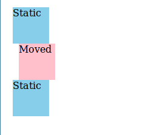


### translateX
Зрушує елемент щодо його звичайного положення по осі X.

```css
translateX(n)
```


### translateY
Зрушує елемент щодо його звичайного положення по осі Y.

```css
translateY(n)
```


### scale
Масштабує елементи, роблячи їх більше або менше. Значення від 0 до 1 зменшують елемент. Перше значення масштабує елемент по ширині, друге - по висоті. Негативні значення відображають елемент дзеркально.

```css
scale(x,y)
```


### scale
```html
<div>Normal</div>
<div class="scaled">Scaled</div>
```

**css**:
```css
div {
  width: 80px;
  height: 80px;
  background-color: skyblue;
}

.scaled {
  transform: scale(0.7); /* Equal to scaleX(0.7) scaleY(0.7) */
  background-color: pink;
}
```


### scale
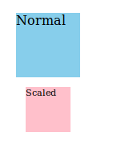


### scaleX
Функція масштабує елемент по ширині, роблячи його ширше або вже. Якщо значення більше одиниці, елемент стає ширше, якщо значення знаходиться між одиницею і нулем, елемент стає вже. Негативні значення відображають елемент дзеркально по горизонталі.

```css
scaleX(n)
```


### scaleY

Функція масштабує елемент по висоті, роблячи його вище або нижче. Якщо значення більше одиниці, елемент стає вище, якщо значення знаходиться між одиницею і нулем - нижче. Негативні значення відображають елемент дзеркально по вертикалі.

```css
scaleY(n)
```


### rotate
Повертає елементи на задану кількість градусів, негативні значення від -1deg до -360deg повертають елемент проти годинникової стрілки, позитивні - за годинниковою стрілкою. Значення rotate (720deg) повертає елемент на два повних обороту.

```css
rotate(кут)
```


### rotate
```html
<p>foo</p>
<p class="transformed">bar</p>
```

```css
p { 
  width: 50px;
  height: 50px;
  background-color: teal;
}

.transformed{
  transform: rotate(45deg);
  background-color: blue;
}
```


### rotate
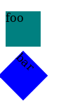


### skew
Використовується для деформування (спотворення) сторін елемента щодо координатних осей. Якщо вказано одне значення, друге буде визначено браузером автоматично.

```css
skew(x-кут,y-кут)
```


### skew
```html
<div>Regular</div>
<div class="skewed">Skewed</div>
```

```css
div {
  width: 80px;
  height: 80px;
  background-color: skyblue;
}

.skewed {
  transform: skew(10deg, 10deg);
  background-color: pink;
}
```


### skew
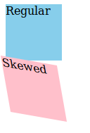


### skewX
Деформує боку елемента щодо осі X.

```css
skewX(кут)
```


### skewY
Деформує боку елемента щодо осі Y.

```css
skewY(кут)
```


## Переходи


### Переходи
**CSS3-переходи** дозволяють анімувати початкове значення CSS-властивості на нове значення з плином часу, керуючи швидкістю зміни значень властивостей.

Зміна властивостей відбувається при настанні певної події, яке описується відповідним псевдоклас. Найчастіше використовується псевдоклас: hover.

Переходи застосовуються до всіх елементів, а також до псевдоелементи: before та: after. Для завдання всіх властивостей переходу зазвичай використовують коротку запис властивості transition.


### transition-property
Містить назву CSS-властивостей, до яких буде застосовано ефект переходу. Значення властивості може містити як одну властивість, так і список властивостей через кому. При створенні переходу можна використовувати як початкова, так і кінцевий стан елемента.

```css
div {
    width: 100px;
    transition-property: width;
}
    div:hover {
    width: 300px;
}
```


### transition-duration
Задає проміжок часу, протягом якого повинен здійснюватися перехід. Якщо різні властивості мають різні значення для переходу, вони вказуються через кому. Якщо тривалість переходу не вказана, то анімація при зміні значень властивостей відбуватися не буде.

```css
div {
transition-duration: .2s;
}
```


### transition-timing-function

Властивість задає тимчасову функцію, яка описує швидкість переходу об'єкта від одного значення до іншого. Якщо ви визначаєте більше одного переходу для елемент, наприклад, колір фону елемента і його положення, ви можете використовувати різні функції для кожного властивості.

```css
div {
transition-timing-function: linear;
}
```


### transition-timing-function
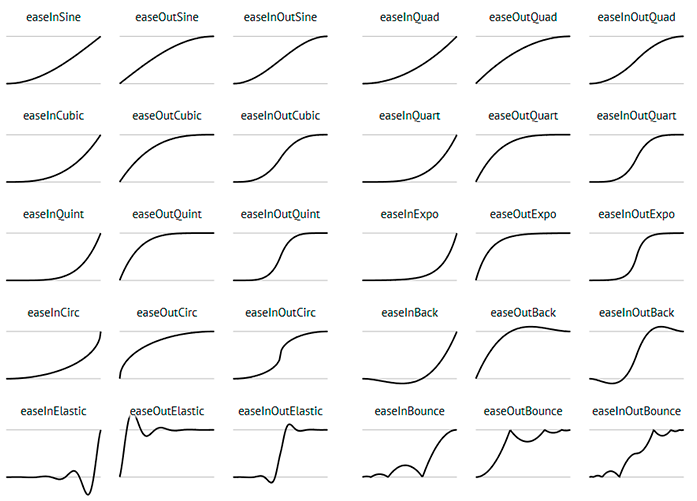


### transition-delay
Необов'язкове властивість, дозволяє зробити так, щоб зміна властивості відбувалося не моментально, а з деякою затримкою.

```css
div {
transition-delay: .5s;
}
```


### Короткий запис переходу
Всі властивості, що відповідають за зміну зовнішнього вигляду елемента, можна об'єднати в одну властивість transition

```css
{
    transition: transition-property transition-duration transition-timing-function transition-delay;
}
```


### Короткий запис переходу
Якщо скористатися значеннями за замовчуванням, то запис

```css
div {transition: 1s;}
```

буде еквівалентний

```css
div {transition: all 1s ease 0s;}
```


### Приклад transition
[CodePen](https://codepen.io/nazarelen/pen/gbLXYK)


## Анімація на keyframe


### Анімація на keyframe
Щоб створити CSS-анімацію Ви повинні додати в стиль елемента, який хочете анімувати, властивість animation або його подсвойства. Це дозволить Вам налаштувати прискорення і тривалість анімації, а також інші деталі того, як анімація повинна протікати. Це не допоможе Вам налаштувати зовнішній вигляд анімації, який налаштовується за допомогою @keyframes.


### animation
Властивість animation має наступні підвластивості:

1. animation-delay
Налаштовує затримку між часом завантаження елемента і часом початку анімації.

3. animation-direction
Дає можливість при кожному повторі анімації йти по альтернативному шляху, або скинути всі значення і повторити анімацію.

4. animation-duration
Визначає час, протягом якого повинен пройти один цикл анімації.


### animation
5. animation-iteration-count
Визначає кількість повторенні анімації; Ви можете використовувати значення infinite для нескінченного повторення анімації.

6. animation-name
Визначає ім'я @keyframes, який налаштовує кадри анімації.

7. animation-play-state
Дозволяє Вам призупинити і відновити анімацію.

8. animation-timing-function
Налаштовує прискорення анімації.


### @keyframe
Після того, як ви налаштували тимчасові властивості (тривалість, прискорення) анімації, ви повинні визначити зовнішній вигляд анімації. Це робиться за допомогою двох і більше ключів після @keyframes. Кожен ключ описує, як повинен виглядати анімований елемент в поточний момент.

У той час як тимчасові характеристики (тривалість анімації) вказуються в стилях для аніміруемого елемента, ключі використовують percentage, щоб визначити стадію протікання анімації. 0% означає початок анімації, а 100% її кінець. Так як ці значення дуже важливі, то для них придумали спеціальні слова: from і to.


### @keyframe
```html
<p>The Caterpillar and Alice looked at each other for some time in silence:
at last the Caterpillar took the hookah out of its mouth, and addressed
her in a languid, sleepy voice.</p>
```

```css
p {
  animation-duration: 3s;
  animation-name: slidein;
}

@keyframes slidein {
  from {
    margin-left: 100%;
    width: 300%; 
  }

  to {
    margin-left: 0%;
    width: 100%;
  }
}
```


### Приклад анімації із використанням keyframes
[JSFiddle](https://jsfiddle.net/0zxugscn/)


### Приклад анімації із використанням keyframes №2
```html
<p>The Caterpillar and Alice looked at each other for some time in silence:
at last the Caterpillar took the hookah out of its mouth, and addressed
her in a languid, sleepy voice.</p>
```

```css
p {
  animation-duration: 3s;
  animation-name: slidein;
  animation-iteration-count: infinite;
}
@keyframes slidein {
  from {
    margin-left: 100%;
    width: 300%; 
  }

  to {
    margin-left: 0%;
    width: 100%;
  }
}
```


### Приклад анімації із використанням keyframes №2
[JSFiddle](https://jsfiddle.net/co8mu0y4/)


### Приклад анімації із використанням keyframes №3
```html
<p>The Caterpillar and Alice looked at each other for some time in silence:
at last the Caterpillar took the hookah out of its mouth, and addressed
her in a languid, sleepy voice.</p>
```

```css
p {
  animation-duration: 6s;
  animation-name: slidein;
}
@keyframes slidein {
  from {
    margin-left: 100%;
    width: 300%;
    background-color: red;
  }
  30% {
    background-color: orange;
  }
  to {
    margin-left: 0%;
    width: 100%;
  }
}
```


### Приклад анімації із використанням keyframes №3
[JSFiddle](https://jsfiddle.net/mayoz7t5/8/)


## Animate.css


### Animate.css
[animate.css](https://daneden.github.io/animate.css/) is a bunch of cool, fun, and cross-browser animations for you to use in your projects. Great for emphasis, home pages, sliders, and general just-add-water-awesomeness.

[Документація](https://github.com/daneden/animate.css)


### Animate.css
```html
&lt;!DOCTYPE html&gt;
&lt;html lang=&quot;en&quot;&gt;
&lt;head&gt;
    &lt;meta charset=&quot;UTF-8&quot;&gt;
    &lt;meta name=&quot;viewport&quot; content=&quot;width=device-width, initial-scale=1.0&quot;&gt;
    &lt;meta http-equiv=&quot;X-UA-Compatible&quot; content=&quot;ie=edge&quot;&gt;
    &lt;link rel=&quot;stylesheet&quot; href=&quot;https://cdnjs.cloudflare.com/ajax/libs/animate.css/3.7.0/animate.min.css&quot;&gt;
    &lt;title&gt;Document&lt;/title&gt;
&lt;/head&gt;
&lt;body&gt;
    
    &lt;section&gt;
        &lt;div class=&quot;animated shake infinite&quot;&gt;
            Lorem ipsum dolor sit amet consectetur adipisicing elit. Expedita dignissimos voluptates architecto sequi quaerat deleniti dolore iure enim ducimus aperiam illum, iste vel repellendus nobis corporis labore sit dicta rem.
        &lt;/div&gt;
    &lt;/section&gt;

&lt;/body&gt;
&lt;/html&gt;
```

