# Базовий CSS

# Зміст

${toc}

# Що таке CSS?

> **CSS** (англ. Cascading Style Sheets, укр. Каскадні таблиці стилів) — спеціальна мова, що використовується для опису зовнішнього вигляду сторінок, написаних мовами розмітки даних.

> **CSS** має різні рівні та профілі. Наступний рівень CSS створюється на основі попередніх, додаючи нову функціональність або розширюючи вже наявні функції. Рівні позначаються як **CSS1**, **CSS2** та **CSS3**. Профілі — сукупність правил CSS одного або більше рівнів, створені для окремих типів пристроїв або інтерфейсів. Наприклад, існують профілі CSS для принтерів, мобільних пристроїв тощо.


# Як підключити CSS до HTML - сторінки?

Застосувати CSS можна трьома способами:

1. Прописати правила всередині тега.
2. Прописати теги всередині тегу style всередині head.
3. Підключити окремий файл із CSS - стилями.

## Атрибут style

Атрибут style застосовується для визначення стилю елемента за допомогою правил CSS.

```html
<p style="color: red;">Some text</p>
```

## Тег style

Тег &lt;style&gt; застосовується для визначення стилів елементів веб-сторінки. Тег &lt;style&gt; необхідно використовувати всередині контейнера &lt;head&gt;. Можна задавати більш ніж один тег &lt;style&gt;.

```html
<head>
    <style type="text/css">
    p {
        color: red;
    }
    </style>
</head>
```

## Підключення зовнішнього файлу із CSS - стилями

Найчастіше стилі підключають із зовнішнього файлу з розширенням .css. Для цього використовується тег &lt;link&gt;. наприклад:

```html
<head>
  <link href="external.css" rel="stylesheet">
</head>
```

В атрибуті href задають адресу файлу, а атрибут rel = "stylesheet" говорить браузеру, що ми підключаємо стилі, а не щось інше.

Краще підключати стилі всередині &lt;head&gt;, але це необов'язково. Тег &lt;link&gt; буде працювати і в іншому місці сторінки.

# Синтаксис правил CSS

Основне правило CSS складається з двох головних частин: **селектор**, і одину або більше оголошень:

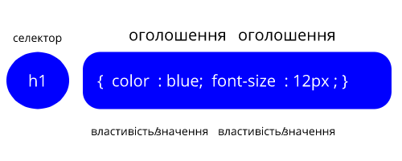

- **Селектор** - це HTML елемент, якому ви хочете надати певний стиль.
- Кожне оголошення складається з властивості і його значення.
- Властивість - це атрибут стилю, який ви хочете змінити. Кожна властивість має значення.

Оголошення CSS завжди закінчується крапкою з комою, і групи оголошень полягають у фігурні дужки:

```css
p {
    color: blue;
}
```

# CSS - селектори

## Всі елементи

Цей базовий селектор вибирає всі елементи. Він також існує у варіанті для локального і глобального простору імен.

```css
* {

}
```

## Тег

Селектор тег відповідає елементам за назвою вузла. Іншими словами, він вибирає всі елементи даного типу в документі.

```css
a {
  color: red;
}
```

## Ієрархія тегів

**Комбінатор ' '** вибирає елементи, які знаходяться всередині зазначеного елемента (незалежно від рівня вкладеності).

```html
<div>
    <p><span></span></p>
</div>
```

```css
div span{
    color:red;
}
```

**Комбінатор '>'** вибирає елементи, які є дочірніми безпосередньо по відношенню до зазначеного елементу.

```html
<ul>
    <li></li>
    <li></li>
</ul>
```

```css
ul > li{
    color: red;
}
```

**Комбінатор '~'** вибирає елементи, які знаходяться після зазначеного елемента, якщо у них загальний батько.

```html
<div>
    <p></p>
    <span></span>
</div>
```

```css
p ~ span{
    color: red;
}
```

## id

Цей базовий селектор вибирає елементи, грунтуючись на значенні їх id атрибута. Не забувайте, що ідентифікатор повинен бути унікальним, т. Е. Використовуватися тільки для одного елемента в HTML-документі.

```html
<div id="motivation">
</div>
```

```css
#motivation{
    color:red;
}
```

## class

Цей базовий селектор вибирає елементи, грунтуючись на значенні їх атрибута class.

```html
<div>
    <div><a class="myLink"></a></div>
    <div><a class="myLink"></a></div>
</div>
```

```css
.myLink{
    color: red;
}
```

## Атрибут

Цей базовий селектор вибирає елементи, грунтуючись на одному з їх атрибутів і / або його значенні.

```html
<div>
    <input type="radio" name="first">
</div>
<div>
    <input type="radio" name="second">
</div>
```

```css
input[type=radio][name=first]
```

# Одиниці виміру в CSS

## px

**Пі́ксель** (іноді пі́ксел, англ. pixel, скорочено від англ. PICture'S ELement — елемент зображення) — найдрібніша одиниця цифрового зображення в растровій графіці. Він являє собою неподільний об'єкт прямокутної (зазвичай квадратної) форми, що має певний колір.

```css
.p{
    width: 100px;
    height: 100px;
}
```

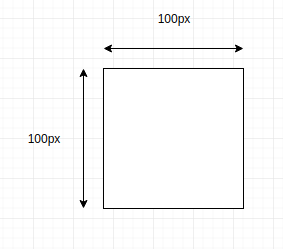

## %

Відсоток це одиниця виміру елемента щодо його блоку батьківського блоку.

```html
<div id="parent">
    <div class="child">

    </div>
    <div class="child">

    </div>
</div>
```

```css
#parent{
    width: 100px;
}

.child{
    width: 50%;
}
```

## em

Одиниці em залежать від розміру шрифту і можуть бути свої для кожного елемента в документі. Одиниця em - просто розмір шрифту.

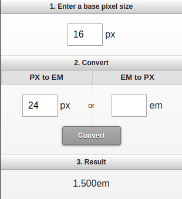

## rem

Один rem (від «root em», тобто «кореневої em» або «em кореневого елемента») - це розмір шрифту кореневого елементу в документі. На відміну від em, який може бути для кожного елемента свій, rem для всього документа один і той же.

# Колір в CSS

## Константи

Усі сучасні веб-переглядачі підтримують [наступні 140 назв кольорів](https://www.w3schools.com/cssref/css_colors.asp)

```css
p{
    color: black;
}
```

## RGB

**RGB** (скорочено від англ. Red, Green, Blue — червоний, зелений, синій) — адитивна колірна модель, що описує спосіб синтезу кольору, за якою червоне, зелене та синє світло накладаються разом, змішуючись у різноманітні кольори. Широко застосовується в техніці, що відтворює зображення за допомогою випромінення світла.

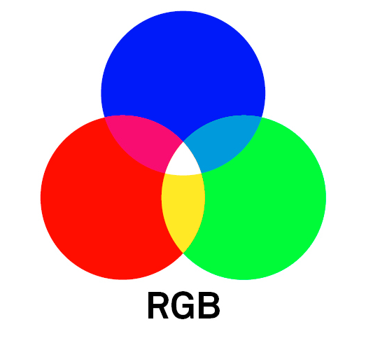

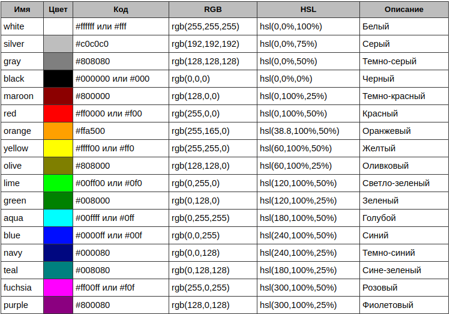

```css
p{
    color: rgb(255,255,255);
}
```

```css
p{
    color: #ffffff;
}
```

## RGBA

RGBa - стандартні кольори rgb, але з альфа-прозорістю.

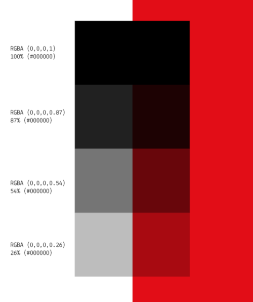

```css
p{
    color: rgba(255,255,255,0.5);
}
```

# Типографіка

"Веб типографіка" стосується відображення всього тексту на вашому сайті. Вона включає в себе основні властивості тексту CSS, наприклад, який шрифт використовувати і чи повинен він бути курсивом чи ні, але сама по собі типографіка означає набагато більше. Мова йде про простір між буквами, словами та рядками. Це розмір різних відступів тексту по відношенню один до одного, а також історія за кожною сімейством шрифтів.


## Безпечні ВЕБ - шрифти

Давним давно веб-розробники мали в своєму розпорядженні лише «веб-безпечні шрифти». Це колекція з десятка шрифтів, які були попередньо встановлені на більшості комп'ютерів. Не було такого, як користувацький файл шрифту, який можна було б передати браузерам для використання на вашому веб-сайті.

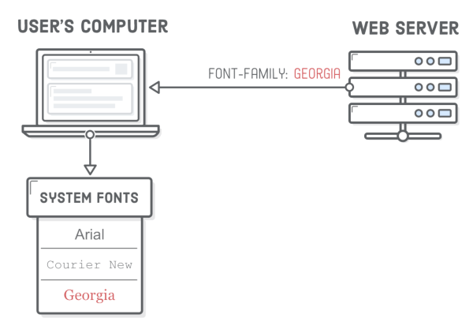

Якщо вам знадобився спеціальний шрифт, єдиним варіантом було експортувати зображення тексту, яке ви хотіли показати, і включити його до веб-сторінки з елементом &lt;img /&gt;. Це було смішнe обмеження для веб-дизайнерів, які призвели до деяких досить hacky ситуації для розробників.

## Користувацькі шрифти

Близько 2010 року браузери почали підтримувати користувацькі веб-шрифти, що було чудово, за винятком того, що кожен браузер і пристрій вимагали іншого формату файлів. Відповідно, більшість веб-сайтів надає 4 різних файли веб-шрифтів:

|Формат|Пояснення|
|-|-|
|.svg|Старий формат Safari|
|.eot|Internet Explorer|
|.ttf|Всі браузери, крім Internet Explorer|
|.woff|Сучасні браузери|

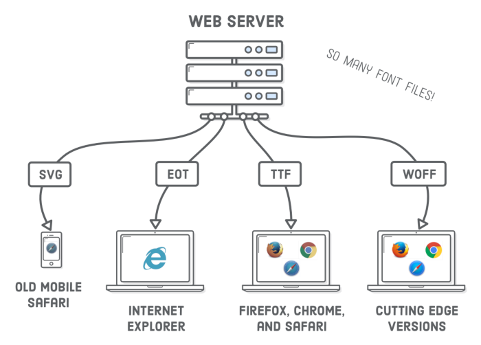

## WOFF

Нещодавно галузь стандартизувала формат Web Open Font (WOFF), тому робота із шрифтами для нас стала дещо простішою. Більше 90% сучасних браузерів підтримують шрифти .woff, а підтримка наступної версії .woff2 зростає. WOFF2 схожий на оригінальний формат WOFF, але пропонує значне зменшення розміру файлу (що означає кращу продуктивність).

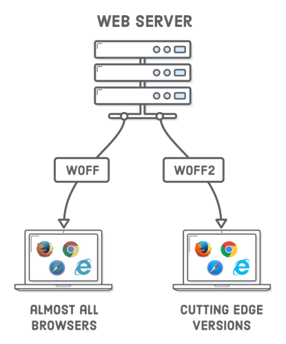

Зрештою, вам потрібно буде лише підтримати WOFF2, але потрібно і розглядати варіант WOFF та WOFF2, щоб отримати пристойне покриття для старих браузерів та покращити продуктивність сучасних. Якщо старі браузери не складають велику кількість вашої цільової аудиторії, шрифти .ttf, .svg і .eot є минулим.

## Де знайти шрифти?

Є багато місць у мережі, де можна завантажити як безкоштовні, так і преміум веб-шрифти. Знову ж таки, який шрифт, як правило, залежить від вашого дизайнера (і їх бюджету), але як розробника, все одно добре знати компроміси між цими параметрами.

|Вебсайт|Ціна|Якість|Асортимент|
|-|-|-|-|
|[Font Squirrel](https://www.fontsquirrel.com/)|Безкоштовно||Великий|
|[Google Fonts](https://fonts.google.com/)|Безкоштовно|Хороша|Достатній|
|[Fontspring](https://www.fontspring.com/)|Платні|Наймовірна|Великий|

## Локальні шрифти на прикладі Google Fonts

## CDN шрифти на прикладі Google Fonts

## Локальні чи CDN

Стверджується наступне: "CDN швидше!" Ідея полягає в тому, що CDN буде швидше, тому що він зменшує навантаження на ваш сервер. Все, що обробляється іншим сервером, означає менше роботи на ваш сервер. І це цілком вірно. Крім того, багато CDN мають географічно розподілені дата центри, що означає, що хтось в Індії може завантажити ваш кіт відео з більш близького сервера, ніж ваш в Мічигані. Крім того, більше людей завантажили спільні ресурси (наприклад, шрифти Google), тому він не буде завантажуватися знову.

Тим не менш, невеликі, локальні сайти або легко завантажені сайти рідко потребують таких речей, і CDN може лише додати ще одне ускладнення до налаштування.

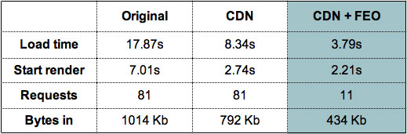

# CSS властивості шрифтів

## font-size

## font-size-adjust

## font-stretch

## font-style

## font-variant

## font-weight

## font

# CSS властивості тексту

## color

## text-align

## text-indent

## letter-spacing

## word-spacing

## text-decoration

## text-transform

## text-direction

## text-shadow

## white-space

# reset.css vs normilize

Кожен браузер встановлює свої значення стилів за замовчуванням для різних HTML-елементів. За допомогою CSS Reset ми можемо нівелювати цю різницю для забезпечення кросбраузерності стилів.

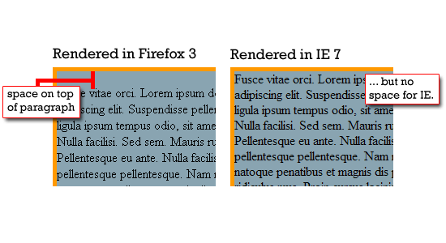

CSS Reset вперше був застосований в далекому 2004 рік Ендрю Креспанісом (Andrew Krespanis). У своїй статті він радив використовувати універсальний селектор (*) на початку CSS-файлу, щоб задати всім елементам нульові відступи (margin і padding).

```css
* 
{
  margin: 0;
  padding: 0;
}
```

Універсальний селектор працює як регулярний вираз, захоплюючи кожен елемент на своєму шляху, не перебираючи і пощади. Але тепер у нас взагалі немає ніяких відступів, в тому числі між окремими параграфами! Що робити? Чи не брехати і не боятися: нижче нашого скидання ми опишемо потрібне нам правило.

```css
* { margin: 0; padding: 0; }
p { margin: 5px 0 10px 0; }
```

Незабаром після цього, CSS-гуру Ерік Мейер (Eric Meyer) виробляє подальші дослідження вищеописаного прийому скидання відступів. У них він зачіпає роботу Тантека Челік і його набір CSS-правил undohtml.css, в якому не тільки скидалися відступи, але і встановлювалися базові значення інших атрибутів: стилі шрифтів, стилі списків.

Після численних переробок і уточнень, ми приходимо до чудового рішенням під назвою [CSS Reset](https://meyerweb.com/eric/tools/css/reset/index.html).

**Best practices** for rest.css:
- Ваш CSS Reset - це перше, що повинен побачити браузер
- Використовуйте окремий CSS-документ для CSS Reset


**Normalize.css** є альтернативою CSS Reset. Проект є продуктом сотень годин глибокого дослідження відмінностей між початковими стилями браузера. Це дослідження провели Ніколас Галахер, @necolas і Джонатан Ніл, @jon_neal.

Цілі normalize.css:
- зберігати корисні настройки браузера, а не скидати їх;
- нормалізувати стилі для широкого кола HTML-елементів;
- коригувати помилки і основні невідповідності браузера;
- удосконалювати юзабіліті непомітними поліпшеннями;
- пояснювати код, використовуючи коментарі та детальну документацію.

# Can i use

["Can i use"](https://caniuse.com) надає сучасні таблиці підтримки різних css фіч для десктоп і мобільних браузерів.

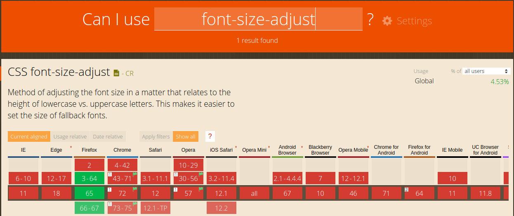

# Домашнє завдання

Додайте до вашого проекту CSS Reset або normilize. Виберіть і реалізуйте веб - типографіку для проекту.

# Контрольні запитання

1. Що таке CSS?
2. Як можна підключити CSS до HTML - сторінки?
3. Поясніть синтаксис CSS. Які CSS - селектори ви знаєте?
4. Що таке Веб - типографіка?
5. Що таке reset.css і normalize.css?