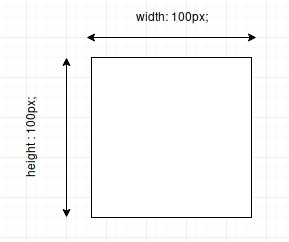
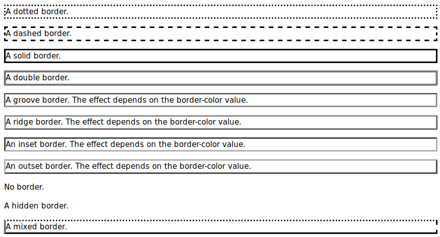

# Позиціонування блоків на сторінці. Строкові і плаваючі елементи

# Зміст

${toc}

# Розміри блоку

Властивості width та heigth використовуються для встановлення висоти та ширини елемента.

Висоту і ширину можна встановити на auto (це за замовчуванням. Значить, що браузер обчислює висоту і ширину) або вказується у значеннях довжини, наприклад px, cm тощо, або у відсотках (%) блоку, що містить.

```css
div{
    width: 100px;
    height: 100px;
}
```



# Відступи

## margin

Властивість margin задає зовнішні відступи елемента - відступи від зовнішньої межі елементу до кордонів батьківського елемента або до сусідніх елементів.

Способи запису властивості margin аналогічні властивості padding.

```css
margin: 10px;
margin: 5px 10px;
margin: 5px 10px 15px;
margin: 5px 10px 15px 20px;
```

1. Однакові відступи з усіх сторін.
2. Зверху і знизу 5px, праворуч і ліворуч 10px.
3. Зверху 5px, зліва і справа 10px, знизу 15px.
4. Верхній, правий, нижній, лівий відступи відповідно.

Можна задавати відступи для різних сторін за допомогою властивостей margin-left, margin-right, margin-top, margin-bottom.

## padding

Властивість padding задає внутрішні відступи елемента - відступи від зовнішньої межі елементу до його змісту. Ці відступи ще іноді називають полями.

Існує кілька способів запису властивості padding.

```css
padding: 10px;
padding: 5px 10px;
padding: 5px 10px 15px;
padding: 5px 10px 15px 20px;
```

1. Однакові відступи з усіх сторін.
2. Відступи зверху і знизу 5px, праворуч і ліворуч 10px.
3. Відступ зверху 5px, зліва і справа 10px, знизу 15px.
4. Різні відступи з усіх сторін, в порядку верхній, правий, нижній, лівий.

Також можна задавати відступи для різних сторін за допомогою властивостей padding-left, padding-right, padding-top, padding-bottom.

# Границі блоку

Властивість border CSS дозволяють вказати стиль, ширину і колір межі елемента.

```css
p {
    border: [style] [width] [color];
}
```

В якості стилю межі дозволені такі значення:
- dotted
- dashed
- solid
- double
- groove
- ridge
- inset
- outset
- none
- hidden



## Приклад використання border
```html
<p>
  Lorem ipsum dolor sit amet, consectetur adipisicing elit. Ipsa repellat facere voluptatum dolorem explicabo nostrum porro! Ex, aperiam dolorem exercitationem voluptate aliquam, in beatae, odio tempora provident dolores iusto dicta.
</p>
```

```css
p {
  border: solid 2px green;
}
```


## Скруглення країв

## Тінь

# Фоновий колір і фонове зоображення

# Inline - блоки

# Позиціонування на основі строкових елементів

# Плаваючі елементи

# Позиціонування на основі плаваючих елементів

# Фіксоване і абсолютне позиціонування

## position: fixed

## position: absolute

## position: sticky

# Накладання елементів

# Домашнє завдання

# Контрольні запитання

1. У чому різниця між margin і padding?