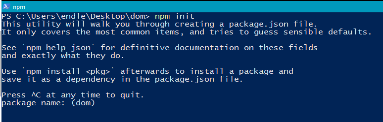
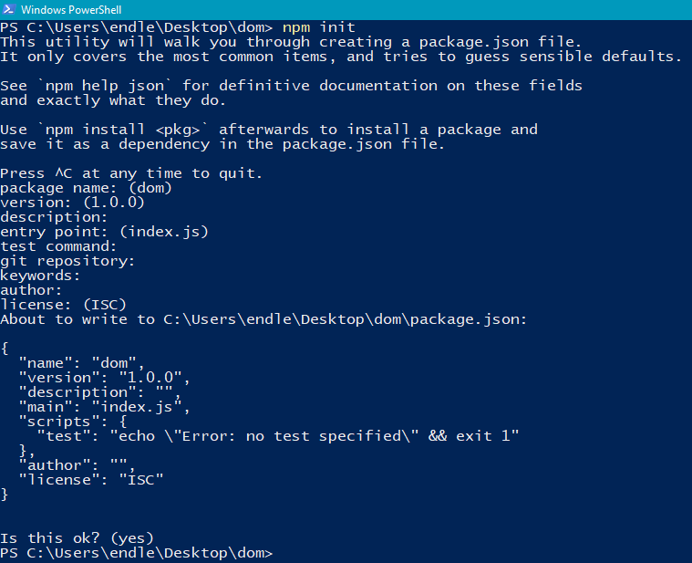
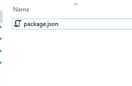
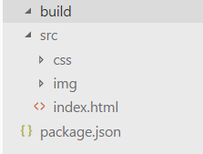
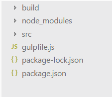

# Front-end project using gulp

# Зміст

${toc}

# Node.js

> Node.js® — це JavaScript–оточення побудоване на JavaScript–рушієві Chrome V8.

Завантажити Node.js можна за посиланням [Node.js](https://nodejs.org/uk/)

Перевірити правильність інсталяції можна виконати команди:

```					
node -version
npm -version				
```

## Створення нового проекту

Створення нового проекту:
1. Відкрийте консоль в робочій директорії проекту
2. Виконайте команду npm init
4. Введіть необхідну інформацію:



Де:

- package name - ім'я проекту
- version - версія проекту
- description - опис проекту
- entry point - точка входу
- test command - команда для запуску тестів
- git repository - адреса git - репозиторія
- keywords - ключові слова для пошуку проекту
- author - ім'я, нік автора
- license - ліцензія список ліцензій



## Структура проекта

Структура створеного проекту:



Файл package.json містить в собі інформацію про застосунок: назва, версія, залежності, тощо. Будь-яка директорія, в якій є цей файл, інтерпретується як Node.js-пакет, навіть якщо ви не збираєтеся публікувати його.

Створимо наступно структуру проекта:



де: 
- src - директорія, яка містить необроблені файли проекта
- build - директорія, яка містить готовий проект, який можна використовувати

## Встановлення пакетів

**npm** - менеджер пакетів, що входить до складу Node.js.

Установка пакету проводиться за допомогою команди:
```
npm install <packagename>
```

```
npm install <package_name>
npm install <package_name> --save-dev(-D)
npm install <package_name> --save-dev(-P)
npm install -g <package_name>
```

# Gulp

Gulp - це пакет, написаний на Node.JS, який допомагає веб-майстрам здійснювати збірку проектів на етапі верстки макетів.

Для встановлення gulp використовуються команди:

```
npm install gulp --save-dev
npm install -g gulp
```

**gulpfile.js** - файл, в якому описана логіка роботи збірки; файл повинен знаходитися в корні.



## Зборка HTML

```js
var gulp = require('gulp'); //import gulp

gulp.task('html', function(){ //create task to cpy all html
    return gulp.src('src/*.html')
    .pipe(gulp.dest('build'));
});
```

## Запуск gulp тасків

```
npx gulp <task_name>
```

```
npx gulp html
```

## Зборка стилів

```js
gulp.task('css', function(){
    return gulp.src('src/css/*/**.css')
    .pipe(gulp.dest('build.css'));
});
```

### gulp default

```js
gulp.task('default', gulp.parallel(
    'html',
    'css'
));
```

Запуск таска - default:

```
npx gulp
```

## Зборка зоображень

```js
gulp.task('img', function(){
    return gulp.src('src/img/**/*')
    .pipe(gulp.dest('build/img'));
});

gulp.task('default', gulp.parallel(
    'html',
    'css',
    'img'
));
```

## Слідкування за зміною файлів

```js
gulp.task('watch', function(){
    gulp.watch('src/*.html', gulp.series('html'));
    gulp.watch('src/css/**/*.css', gulp.series('css'));
    gulp.watch('src/img/**/*', gulp.series('img'));
});

gulp.task('default', gulp.series(
    gulp.parallel(
        'html',
        'css',
        'img'
    ),
    'watch'
));
```

## Browser-sync

Встановлення плагіна:

```
npm install browser-sync --save-dev
```

```js
var gulp = require('gulp');
var browserSync = require('browser-sync').create();

gulp.task('html', function(){
    return gulp.src('src/*.html')
    .pipe(gulp.dest('build'));
});

gulp.task('css', function(){
    return gulp.src('src/css/**/*.css')
    .pipe(gulp.dest('build/css'));
});

gulp.task('img', function(){
    return gulp.src('src/img/**/*')
    .pipe(gulp.dest('build/img'));
});

gulp.task('watch', function(){
    gulp.watch('src/*.html', gulp.series('html')).on('change', browserSync.reload);
    gulp.watch('src/css/**/*.css', gulp.series('css')).on('change', browserSync.reload);
    gulp.watch('src/img/**/*', gulp.series('img')).on('change', browserSync.reload);
});

gulp.task('serve', function() {
    browserSync.init({
        server: {
            baseDir: "./build"
        }
    });
});

gulp.task('default', gulp.series(
    gulp.parallel(
        'html',
        'css',
        'img'
    ),
    gulp.parallel(
        'serve',
        'watch'
    )
));
```

## gulp-autoprefixer

Встановлення плагіна:

```
npm install --save-dev gulp-autoprefixer
```

```js
const autoprefixer = require('gulp-autoprefixer');

....
gulp.task('css', function(){
    return gulp.src('src/css/**/*.css')
    .pipe(autoprefixer({
        browsers: ['cover 99.5%'],
        cascade: false
    }))
    .pipe(gulp.dest('build/css'));
});
```

Подивитися список доступних покрить браузерів можна за посиланням [Full list](https://github.com/browserslist/browserslist#queries)

## gulp-clean-css

Встановлення плагіна:

```
npm install gulp-clean-css --save-dev
```

```js
var cleanCSS = require('gulp-clean-css');

...

gulp.task('css', function(){
    return gulp.src('src/css/**/*.css')
    .pipe(autoprefixer({
        browsers: ['cover 99.5%'],
        cascade: false
    }))
    .pipe(cleanCSS({compatibility: 'ie8'}))
    .pipe(gulp.dest('build/css'));
});
```

# GIT і Node.js проект

# Домашнє завдання

# Контрольні запитання